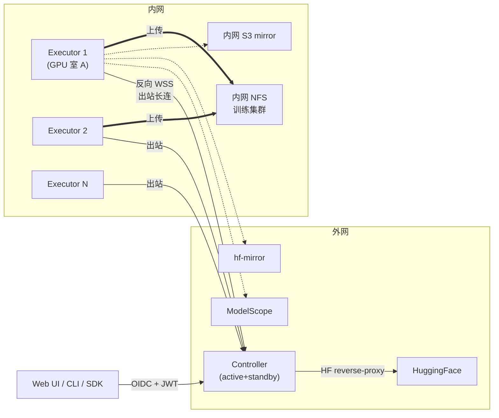

# modelpull

[English](./README_en.md) | 中文

> **📐 设计阶段（Design only）— 暂无可执行代码**
> 寻找的是 **design reviewer**，不是用户。代码实现按 [ROADMAP](./ROADMAP.md) Phase 1 启动。

[](https://github.com/l17728/modelpull/actions/workflows/ci.yml)
[](https://www.apache.org/licenses/LICENSE-2.0)


[](https://github.com/l17728/modelpull/discussions)

⛔ **现在还不能下载模型**。如果你想找一个**能用**的 HF 多机下载工具，本仓库帮不到你。
✅ 如果你是**架构师 / 分布式系统爱好者 / SRE / 想参与设计 review**，欢迎进。

📚 **设计成果**（~28000 行 / 14 章 / OpenAPI / Helm + Prometheus + Grafana / 6 runbook）：

- 入口：[`docs/v2.0/00-INDEX.md`](./docs/v2.0/00-INDEX.md)
- v2.0 GA 后才有代码 — 见 [ROADMAP](./ROADMAP.md)

📌 **不打算做的事**：单机小模型下载、基础 HF 镜像功能 — 这些 [`huggingface_hub.snapshot_download`](https://huggingface.co/docs/huggingface_hub) 已经够用了。

📌 **要做的事**：多机分布式 / 多源加速 / 多租户 / 企业内网部署 / AI Copilot 嵌入式聊天 / 在线运筹优化。详见下方"为什么做这个 + 不用 huggingface_hub 的理由"。

---

## ⚡ 现在你可以做的 3 件事

1. **读 INDEX 决定要不要深入**：[`docs/v2.0/00-INDEX.md`](./docs/v2.0/00-INDEX.md)（按角色推荐 5 条阅读路径）
2. **提 design review issue**：[模板](https://github.com/l17728/modelpull/issues/new?template=design_review.yml) — 当前阶段最有价值的贡献
3. **Star + Watch**：Phase 1 启动时通知

---

## 🚀 Quickstart (Phase 1 dev only)

> Phase 1 已落地：FastAPI controller + PG schema + 健康检查。
> **不能下载模型**；这是 Week 2-6 的实施基础。

需要：Python 3.12、`uv`、本地 PG 16+（或用 docker-compose 起一个）。

```bash
# 1. 拉代码
git clone https://github.com/l17728/modelpull && cd modelpull

# 2. 装 uv（如未装）
curl -LsSf https://astral.sh/uv/install.sh | sh        # macOS/Linux
# winget install astral-sh.uv                          # Windows

# 3. 装 deps
uv sync

# 4a. 起 PG（本机已装 PG 跳过此步，设 DLW_DB_HOST/PORT 环境变量即可）
docker compose -f docker-compose.dev.yml up -d         # PG 16 on :5432
# 或者使用本机 PG：export DLW_DB_PORT=5433（按你实际端口）

# 5. 建 dlw 数据库（一次性）
psql -h $DLW_DB_HOST -p ${DLW_DB_PORT:-5432} -U ${DLW_DB_USER:-postgres} \
     -d postgres -c "CREATE DATABASE dlw"

# 6. 跑 migration
uv run alembic upgrade head    # 创建 8 张表

# 7. 起 controller
uv run uvicorn dlw.main:app --host 0.0.0.0 --port 8000

# 8. 测试 endpoints（另开终端）
curl http://localhost:8000/health/live    # → {"status":"healthy"}
curl http://localhost:8000/health/ready   # → {"status":"ready","db":"ok"}

# 9. 跑 tests
uv run pytest -v               # Phase 1: 18 tests | Week 2: 51 tests
```

### Week 2 demo: drive a mock executor end-to-end via HTTP

```bash
export DLW_BEARER_TOKEN="dev-secret"
TOKEN_HEADER="Authorization: Bearer dev-secret"

# Create a task (auto-creates 2 mock subtasks)
TASK_ID=$(curl -s -X POST http://localhost:8000/api/v1/tasks \
  -H "$TOKEN_HEADER" -H "Content-Type: application/json" \
  -d '{"repo_id":"deepseek-ai/DeepSeek-V3","revision":"0123456789abcdef0123456789abcdef01234567","storage_id":1}' \
  | python -c "import sys,json; print(json.load(sys.stdin)['id'])")
echo "Task: $TASK_ID"

# Register a worker
curl -s -X POST http://localhost:8000/api/v1/executors/join \
  -H "$TOKEN_HEADER" -H "Content-Type: application/json" \
  -d '{"id":"demo-worker","host_id":"demo-host"}'

# Poll twice + report success (token verified)
for i in 1 2; do
  POLL=$(curl -s -X POST http://localhost:8000/api/v1/executors/demo-worker/poll -H "$TOKEN_HEADER")
  SUB_ID=$(echo "$POLL" | python -c "import sys,json; print(json.load(sys.stdin)['subtask']['id'])")
  TOK=$(echo "$POLL" | python -c "import sys,json; print(json.load(sys.stdin)['assignment_token'])")
  curl -s -X POST "http://localhost:8000/api/v1/subtasks/$SUB_ID/report" \
    -H "$TOKEN_HEADER" -H "Content-Type: application/json" \
    -d "{\"status\":\"succeeded\",\"assignment_token\":\"$TOK\",\"actual_sha256\":\"$(printf 'f%.0s' {1..64})\",\"bytes_downloaded\":100000000}"
done

# Verify task completed
curl -s "http://localhost:8000/api/v1/tasks/$TASK_ID" -H "$TOKEN_HEADER"
# Expected: {"status":"succeeded", ...}
```

### Week 3 demo: end-to-end with docker compose

```bash
# 1 command: PG + controller + executor all up
docker compose -f docker-compose.dev.yml up -d --build

# Wait for controller health (executor will pick up automatically once ready)
until curl -s http://localhost:8000/health/ready | grep -q ok; do sleep 1; done
echo "controller ready"

# Submit a task
TOKEN_HEADER="Authorization: Bearer dev-token-change-me"
TASK_ID=$(curl -s -X POST http://localhost:8000/api/v1/tasks \
  -H "$TOKEN_HEADER" -H "Content-Type: application/json" \
  -d '{"repo_id":"o/e2e","revision":"0123456789abcdef0123456789abcdef01234567","storage_id":1}' \
  | python -c "import sys,json; print(json.load(sys.stdin)['id'])")
echo "Task: $TASK_ID"

# Watch the executor pick it up + complete
for i in $(seq 1 30); do
  STATUS=$(curl -s "http://localhost:8000/api/v1/tasks/$TASK_ID" -H "$TOKEN_HEADER" \
    | python -c "import sys,json; print(json.load(sys.stdin)['status'])")
  echo "[$i] task status: $STATUS"
  if [ "$STATUS" = "succeeded" ]; then break; fi
  sleep 1
done

# Inspect downloaded mock files in the executor container
docker compose -f docker-compose.dev.yml exec executor ls -la /downloads
```

### Week 3 UI demo: 浏览器看任务列表 + 实时进度

A 3-page Vue 3 SPA driven by `pnpm dev` against the running controller. HTTP polling (5s on list, 1s on detail with terminal-state stop).

````bash
# Terminal 1 — controller
docker compose -f docker-compose.dev.yml up -d postgres
uv run alembic upgrade head
uv run uvicorn dlw.main:app --port 8000

# Terminal 2 — seed a task so the list isn't empty
# (Replace ${DLW_BEARER_TOKEN} with the value you set in the controller's env)
curl -X POST http://localhost:8000/api/v1/tasks \
  -H "Authorization: Bearer $DLW_BEARER_TOKEN" \
  -H "Content-Type: application/json" \
  -d '{"repo_id":"deepseek-ai/DeepSeek-V3","revision":"abc123def4567890abc123def4567890abc12345","storage_id":1}'

# Terminal 3 — frontend (Vite proxy forwards /api/* to :8000;
# do NOT set VITE_API_BASE for dev — only for `pnpm preview`/production builds)
cd frontend
pnpm install
pnpm dev    # http://localhost:5173
````

Open `http://localhost:5173/`, paste the value of `$DLW_BEARER_TOKEN`, see the
seeded task in the list, click into it. The detail page polls every second
until the task hits a terminal state. Pair with `dlw-executor` in another
terminal to watch subtasks transition from `pending` → `assigned` → `succeeded`.

### Week 4 demo: real HF Hub → MinIO

End-to-end with real HuggingFace + local MinIO. Replaces Week 3's mock pipeline.

````bash
# Boot the full stack: PG + controller + executor + minio + bucket-init
docker compose -f docker-compose.dev.yml up -d --build

# Wait for ready
until curl -s http://localhost:8000/health/ready | grep -q ok; do sleep 1; done

# Create a download task pointing to a small public model (~90MB, multi-file)
TOKEN_HEADER="Authorization: Bearer dev-token-change-me"
TASK_ID=$(curl -s -X POST http://localhost:8000/api/v1/tasks \
  -H "$TOKEN_HEADER" -H "Content-Type: application/json" \
  -d '{"repo_id":"sentence-transformers/all-MiniLM-L6-v2","revision":"main","storage_id":1}' \
  | python -c "import sys,json; print(json.load(sys.stdin)['id'])")
echo "Task: $TASK_ID"

# Watch executor pull from HF and upload to MinIO (~60-120s on a 100Mbps link)
docker compose -f docker-compose.dev.yml logs -f executor

# Check task status
curl -s "http://localhost:8000/api/v1/tasks/$TASK_ID" -H "$TOKEN_HEADER" \
  | python -c "import sys,json; t=json.load(sys.stdin); print(t['status']); print(len(t['subtasks']),'subtasks')"

# Open MinIO console to see uploaded files
echo "MinIO console: http://localhost:9001  (minioadmin / minioadmin)"
````

完整开发计划：

- Phase 1 Foundation：[`docs/superpowers/plans/2026-05-07-phase-1-foundation.md`](./docs/superpowers/plans/2026-05-07-phase-1-foundation.md)
- Phase 1 Week 2 Controller Core：[`docs/superpowers/plans/2026-05-08-phase-1-week-2-controller-core.md`](./docs/superpowers/plans/2026-05-08-phase-1-week-2-controller-core.md)
- Phase 1 Week 3 Executor Process：[`docs/superpowers/plans/2026-05-09-phase-1-week-3-executor-process.md`](./docs/superpowers/plans/2026-05-09-phase-1-week-3-executor-process.md)
- Phase 1 Week 3 UI Scaffold：[`docs/superpowers/plans/2026-05-08-phase-1-week-3-ui-scaffold.md`](./docs/superpowers/plans/2026-05-08-phase-1-week-3-ui-scaffold.md)
- Phase 1 Week 4 HF + S3：[`docs/superpowers/plans/2026-05-09-phase-1-week-4-hf-s3-multipart.md`](./docs/superpowers/plans/2026-05-09-phase-1-week-4-hf-s3-multipart.md)

---

## 为什么做这个

```
DeepSeek-V3 (FP8)            689 GB / 163 文件
Kimi-K2-Instruct (FP8)     1,030 GB / 61 文件
Qwen3-72B-Instruct (BF16)    144 GB / 30 文件
```

单机从 HuggingFace 下载这些模型：

- 国外环境：百兆带宽下需要 8-24 小时
- 国内环境：HF 直连不可用，必须走镜像
- 单机故障 / 中断：从头再来

**多机并行** 把整体下载时间压缩到 **`max(每台机/每源限速)`**；**多源加速** 进一步把时间压到 **`总流量 / 各源带宽之和`**。

### 为什么不用 huggingface_hub.snapshot_download？

最常见的问题先答：

| 维度 | `huggingface_hub` | `modelpull` |
|------|----------------|-----------|
| 单文件并发下载 | ⚠️ hf_transfer 实验性 | ✅ DirectOffsetDownloader |
| 多机协调 | ❌ | ✅ Controller + Executor 架构 |
| 多源加速（HF/Mirror/ModelScope） | ❌ | ✅ 6 个内置源 + 实时测速 + LPT |
| 断点续传跨进程 | ⚠️ 文件名约定 | ✅ DB 持久化 + fence token |
| 多租户 / 配额 | ❌ | ✅ Tenant/Project/User + RBAC |
| 企业内网（NTLM/Kerberos/反向 WSS） | ❌ | ✅ 14 §1 |
| 可观测性（SLO / runbook / chaos） | ❌ | ✅ 5 Grafana / 32 Alert / 6 RB |
| 审计 / 合规（链式哈希 + WORM） | ❌ | ✅ 04 §9 |
| 在线运筹优化（ad-hoc 重新规划） | ❌ | ✅ 13 §4 |

**单机下一两个模型**：用 `huggingface_hub.snapshot_download`，更轻。
**团队 / 平台 / 多模型 / 大规模 / 国内多源加速 / 内网部署**：考虑 modelpull。

### 整体架构（30 秒了解）



**关键性质**：

- Executor 主动出站到 Controller（corp 内网无入站口仍可用）
- HF Token 永不离开 Controller（reverse-proxy 模式）
- 多源同时下，S3 multipart 实现"多 executor 同文件协作"无需跨节点 FS

---

## 核心特性

### 🚀 多源调度（v2.0 头号特性）

内置 6 个源驱动：HuggingFace · hf-mirror.com · ModelScope（魔搭）· WiseModel · OpenCSG · 自托管 S3 mirror。

**一键多源加速**：

1. 任务启动时**实时测速**所有候选源（5-15 秒）
2. 用 LPT 启发式做**最优组合选择**（不一定全用，避免慢源拖累）
3. 文件级路由 + 大文件 chunk 级并行
4. 局部重平衡：源退化自动切换

### 🔒 分布式正确性

- **Fence token + executor epoch**：防止双发 / 陈旧执行器写入
- **三联校验崩溃恢复**：远端存在性 + ChecksumSHA256 + size，绝不假设"DB 标记 verified = 真的 verified"
- **Multipart upload_id 持久化**：崩溃后能 abort 孤儿 multipart
- **HF 是 SHA256 真值来源**：跨源下载完成后用 HF 的 sha 校验

### 🛡️ 安全 / 多租户 / 合规

- mTLS + Executor JWT + 心跳 HMAC
- HF Token reverse-proxy（永不下发到 executor）
- S3 STS 临时凭证
- 三级身份模型（Tenant / Project / User）+ OIDC + RBAC（casbin）
- License 策略 / gated 模型审批 / pickle 拦截
- 审计日志链式哈希（tamper-evident）+ WORM 导出

### 📊 生产可运维

- 4 个核心 SLI/SLO（API 可用性 99.9% / 任务完成率 99% / 吞吐 / E2E 时延）
- 20+ Prometheus 告警（P0/P1/P2 三档分级 + hysteresis + inhibit_rules）
- 6 份可执行 Runbook 脚本
- Active/Standby Controller（RTO ≤ 10 min, RPO ≤ 15 min）
- Chaos / GameDay 演练计划

### 🛠 平台集成

- CLI（`dlw`）+ Python SDK（同步 + 异步）
- HF cache 兼容（设 `HF_HOME` 透明走本系统）
- Webhook（task.completed / failed）
- MLflow Model Registry 自动注册
- K8s Operator + ModelDownload CRD
- 增量 / 差分下载（仅下变化文件）

### 🤖 AI Copilot（v2.1）

- 嵌入式聊天面板：`Ctrl+K` 打开，自然语言驱动 modelpull
- 后端：Claude Code / OpenCode 无头模式，或 Anthropic SDK 直连
- 工具协议：MCP server 暴露 `dlw_*` 工具 + `web_fetch` 受信源
- 写操作必须用户确认；所有动作进 audit log
- 示例 query：「下载 DeepSeek 最新发布的 V3」/「我哪些任务上周失败了？为什么？」/「对比 Qwen3-72B 和 Llama-3.1-70B」

### 📐 自适应下载运筹优化（v2.1）

- 形式化为最优化问题：minimize makespan + α × switch_cost
- 持续在线决策（30s 周期 + 事件触发）：改 source / 换 executor / 进一步切分大文件
- **子分片**：慢的大文件再切成 sub-chunk，多 executor 并行下载，**通过 S3 multipart upload 协议拼装**（无需跨节点 FS 访问）
- 切换前算成本：已下载字节作废 vs 新方案完成时间收益，hysteresis 防抖动
- 已下载部分默认不动，除非成为整体瓶颈
- 决策审计表 `optimization_decisions` 可回放、可训练
- 触发时机自适应：三级（hard / soft / 周期）+ 周期 [5s,120s] + 瓶颈聚焦 + 信息门控

### 🏢 企业内网部署支持（v2.1）

- **反向控制通道**：Executor 在公司内网无入站 IP；启动后主动开 WSS 到外网 controller，corp proxy 穿透；controller 可近实时推命令（cancel / replan）
- **限速维度探测**：自动识别 corp gateway 限速是按 connection / IP / user，driving 子分片策略选择
- **本地凭证池**：每个 executor 配置文件管理多个 gateway 账号 / HF token / S3 AKSK；凭证不出本机（controller 仅知 alias）
- **别名系统**：执行器 / 存储后端 / 源 / 用户 / 项目 都支持 display_name（"GPU室 A worker 1" / "训练集群 NFS"）
- **Live Console**：admin 一站式实时日志滚动 UI，含组件 / 任务 / 级别过滤
- **S3 源直连**：UI 指定 S3 bucket+path 作为源，多 executor 多连接 Range 切片下载，按 alias 选凭证

---

## 仓库结构

```
modelpull/
├── docs/
│   ├── v2.0/                                    👈 当前设计权威
│   │   ├── 00-INDEX.md                          导航 + 角色阅读路径
│   │   ├── 01-architecture.md                   架构 / 状态机 / 数据模型
│   │   ├── 02-protocol.md                       API / 心跳 / WS 协议
│   │   ├── 03-distributed-correctness.md        Fence token / 恢复语义
│   │   ├── 04-security-and-tenancy.md           认证 / 租户 / 配额 / 合规
│   │   ├── 05-operations.md                     SLO / Runbook / 备份 / 灰度
│   │   ├── 06-platform-and-ecosystem.md         多源 / CLI / 集成 / Roadmap
│   │   ├── 07-test-plan.md                      ~450 测试矩阵
│   │   ├── 08-mvp-roadmap.md                    4 Phase 切片 + 任务分解
│   │   ├── 09-migration.md                      v1.x → v2.0 迁移
│   │   ├── 10-frontend-wireframes.md            9 个核心页面 wireframe
│   │   ├── 11-cli-and-sdk-spec.md               dlw CLI + Python SDK 规范
│   │   ├── 12-ai-copilot.md                     AI Copilot 嵌入聊天 + MCP 工具（v2.1）
│   │   ├── 13-adaptive-download-optimization.md 在线运筹优化 + 子分片 + S3 多 executor 协作（v2.1）
│   │   └── 14-enterprise-network-and-rate-limit.md 内网部署 / 限速探测 / 凭证池 / 别名 / Console（v2.1）
│   └── archive/                                 v1.x 历史版本（已 superseded）
│
├── api/
│   └── openapi.yaml                             OpenAPI 3.1 完整 spec（可生成 SDK）
│
└── deploy/
    ├── helm/                                    Helm chart（生产就绪）
    │   ├── Chart.yaml + values.yaml
    │   └── templates/                           7 份 K8s 资源模板
    ├── prometheus/
    │   ├── recording-rules.yaml                 SLI + multi-burn-rate
    │   └── alerting-rules.yaml                  20+ 告警规则
    ├── alertmanager/
    │   └── routes.yaml                          PagerDuty/Slack/Jira 路由
    ├── grafana/
    │   ├── overview-dashboard.json
    │   └── slo-dashboard.json
    └── runbooks/scripts/                        6 个可执行 runbook 脚本
        ├── promote-standby.sh                   控制器故障切换
        ├── drain-executor.sh                    Executor 优雅排空
        ├── gc-orphan-parts.sh                   孤儿 .parts/ 清理
        ├── rotate-executor-mtls.sh              mTLS 证书轮换
        ├── verify-backup.sh                     夜间备份可恢复性验证
        └── maintenance.sh                       维护模式
```

---

## 谁应该读哪份

| 角色 | 推荐阅读路径 |
|------|------------|
| 👨‍💻 架构师 / 评审者 | `01` → `03` → `04` → `02` → `05` → `06` |
| 🔨 后端实现者 | `08` → `01` → `02` → `03` → `04` → `05` → `07` |
| 🧪 QA | `07` → `02` → `03` → `09` |
| 🛡️ 安全审计 | `04` → `02` → `01 §3` → `05 §10` |
| 🚨 SRE / on-call | `05` → `09` → `03 §3` → 部署物料 |
| 👤 用户 / 算法工程师 | `06 §5` (CLI/SDK) → `02 §1` |
| 🏗️ 平台 / 集成方 | `06` → `02` → `04 §1` → `api/openapi.yaml` |
| 📅 PM / Tech Lead | `08` → `07 §8` → `09` |
| 🎨 前端 | `10` → `api/openapi.yaml` |
| 🤖 AI / 应用 | `12` → `02 §5` (SSE) → `04 §6` (安全) |
| 📐 调度 / 算法 | `13` → `06 §1.6 §1.8`（前期反应式版） → `03 §2`（fence） |
| 🏢 内网 / 运维 | `14` → `04 §3`（凭证差异） → `05 §1.2`（日志） → `13 §4.1`（限速联动） |

入口：[`docs/v2.0/00-INDEX.md`](./docs/v2.0/00-INDEX.md)

---

## 设计亮点速读

### 1. 一键多源 = 测速 + LPT + 重平衡

```
任务创建
   ↓
并行测速（5 sources × 4 executors = 20 并发探测，软超时 8s）
   ↓
EWMA 融合（实测 0.7 + 历史 0.3）
   ↓
最优组合选择（不一定全用，引入慢源 +2% 协调开销惩罚）
   ↓
LPT 启发式 file-level 分配（最长任务先分给最快源）
   ↓
大文件（≥100MB）+ 多源 → chunk-level 并行
   ↓
下载中持续校准 → 退化触发局部重平衡
```

详见 [`06 §1.8`](./docs/v2.0/06-platform-and-ecosystem.md)。

### 2. Fence Token 防双发

v1.x 的 CAS 仅保护 DB 层，但内存队列 + 心跳响应 + 重连之间存在间隙：

```
T1: A 拿到 S（在内存队列）
T2: A 网络抖动失联
T3: controller 标 A faulty → reclaim S
T4: B 拿到 S 开始下载
T5: A 恢复后还在下载 S（不知道被 reclaim 了）
T6: A 完成 → controller 接受 → 双完成
```

v2.0 引入两层 fence：

- **Executor Epoch**：单调递增，每次 register +1，请求必须带当前 epoch
- **Assignment Token**：每次 assign 生成 fresh UUID，complete 时校验

详见 [`03 §2`](./docs/v2.0/03-distributed-correctness.md)。

### 3. 不变量驱动设计

14 条核心不变量（[`01 §7`](./docs/v2.0/01-architecture.md)），每条都有 CI 断言：

- HF 永远是 SHA256 真值来源
- HF Token 不离开 Controller
- Executor 不持长期 storage 凭证
- 业务表必须有 tenant_id
- ……

CI 强制失败任何违反不变量的 PR。

---

## Roadmap

| 版本 | 内容 |
|------|------|
| **v2.0**（设计完成） | 单租户 → 分布式 → 多租户 + 多源 → 生产加固，4 Phase / 13 周 |
| v2.1 | **AI Copilot first-class** + **自适应下载运筹优化** + **企业内网部署（反向 WSS / 限速探测 / 凭证池 / Console）** + 跨地域复制 + SLA 分级 + 离线 export bundle + 行为遥测预热 |
| v2.2 | Active-active controller + Sigstore 验签 + 模型在线量化 + BLAKE3 流式哈希 |
| v2.3 | 多 controller cluster（按 tenant 分片）|

详见 [`08 §7`](./docs/v2.0/08-mvp-roadmap.md)。

---

## 现状声明

✅ **完成**：

- 18000+ 行设计文档 + 部署物料
- 完整 OpenAPI 3.1 spec（可生成 SDK）
- 5 位虚拟 reviewer 的 70+ 条问题已修复（架构一致性 / 分布式正确性 / 安全 / 运维 / 盲区）
- 4-Phase 13 周实施 roadmap
- v1.x → v2.0 数据迁移方案
- Helm chart + Prometheus 告警 + Grafana dashboard + 6 份 runbook 脚本

🚧 **待开始**：

- 后端代码实现（Python + FastAPI + SQLAlchemy）
- 前端代码实现（Vue 3 + Pinia + Element Plus）
- CLI / Python SDK 实现
- E2E 测试与 chaos 演练落地

---

## 贡献

设计阶段欢迎对架构 / 协议 / 不变量提出 review 意见。详见 [CONTRIBUTING.md](./CONTRIBUTING.md)。

3 种 issue 模板：

- 🐛 [Bug Report](https://github.com/l17728/modelpull/issues/new?template=bug_report.yml) — 文档矛盾 / 规范错误 / 部署物料 bug
- ✨ [Feature Request](https://github.com/l17728/modelpull/issues/new?template=feature_request.yml) — 新能力提议
- 🏛 [Design Review](https://github.com/l17728/modelpull/issues/new?template=design_review.yml) — **当前阶段最有价值**：从架构 / 分布式 / 安全 / 运维 / 用户价值 5 个视角 review

讨论：[GitHub Discussions](https://github.com/l17728/modelpull/discussions)

实施开始后将开放代码贡献，遵循 [`07-test-plan.md`](./docs/v2.0/07-test-plan.md) 的覆盖率要求。

---

## 协议

[Apache License 2.0](./LICENSE)。

---

## 致谢

- HuggingFace 团队提供的 Hub API 和 huggingface_hub SDK
- ModelScope（魔搭）社区提供国内镜像
- hf-mirror.com 维护者提供社区镜像
- HuggingFace `hf_transfer` 项目启发了 DirectOffsetDownloader 设计
