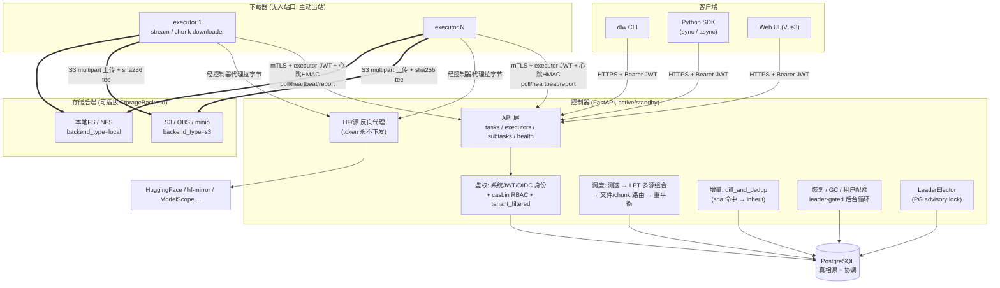
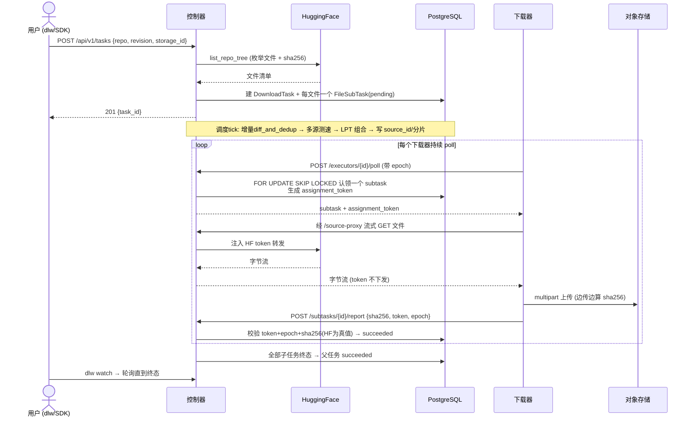
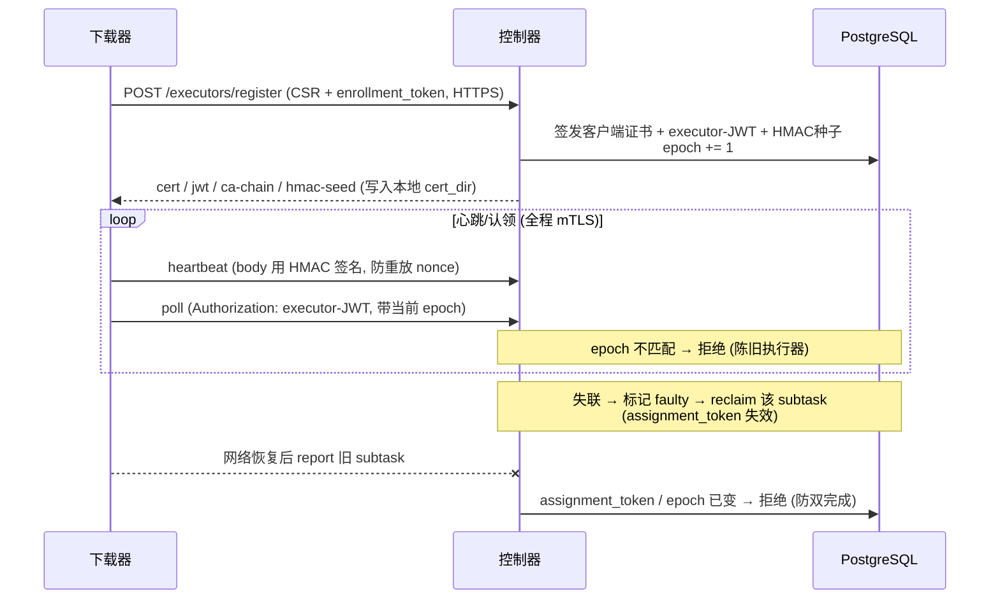
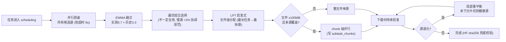
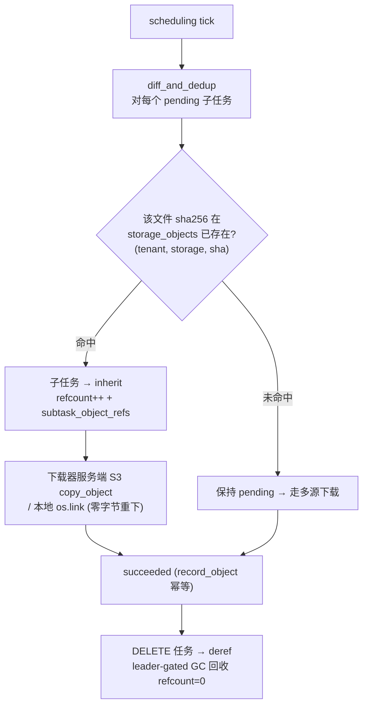
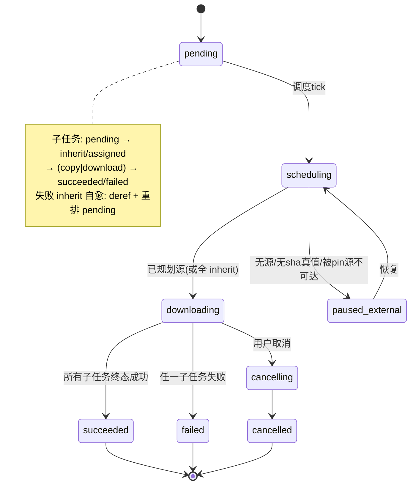
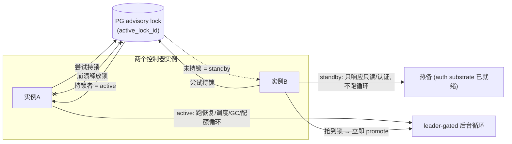
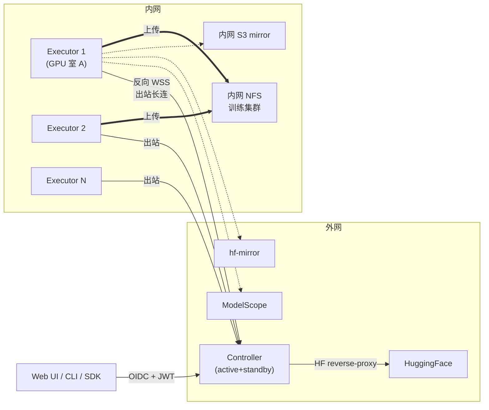

# modelpull

[English](./README_en.md) | 中文

> **✅ 已落地可运行** — v2.0 Phase 1/2/3 全部实现并合并（PR #1–#18，427 测试，CI 全绿）。
> 本机即可拉起：控制器 + 下载器 + 对象存储，用 CLI/SDK 真实下载 HF 模型。
> 上手见 [**用户手册 `docs/getting-started.md`**](./docs/getting-started.md)。

[](https://github.com/l17728/modelpull/actions/workflows/ci.yml)
[](https://www.apache.org/licenses/LICENSE-2.0)


[](https://github.com/l17728/modelpull/discussions)

一个**分布式 HuggingFace 模型权重下载系统**：控制器编排、多下载器并行、多源加速、多租户隔离、增量去重，写入 S3 兼容对象存储。面向 **团队 / 平台 / 大模型 / 多机 / 国内多源 / 企业内网** 场景。

📌 **不做的事**：单机小模型下载 — [`huggingface_hub.snapshot_download`](https://huggingface.co/docs/huggingface_hub) 已经够用。
📌 **做的事**：多机分布式 + 多源加速 + 多租户 + 增量去重 + CLI/SDK + 企业内网部署（v2.1）+ AI Copilot（v2.1）。

📚 设计权威（~28000 行 / 14 章）：[`docs/v2.0/00-INDEX.md`](./docs/v2.0/00-INDEX.md) ｜ 软件架构/交互流程/独特设计见 [👇 软件架构](#-软件架构) / [👇 独特软件设计](#-独特软件设计)。

---

## ⚡ 现在你可以做的 3 件事

1. **本机跑起来**：照 [`docs/getting-started.md`](./docs/getting-started.md) 部署控制器+下载器+minio，用 `dlw submit` 真实下一个模型
2. **读架构**：下方 [软件架构](#-软件架构)（组件 + 交互时序图）与 [独特软件设计](#-独特软件设计)
3. **读设计权威**：[`docs/v2.0/00-INDEX.md`](./docs/v2.0/00-INDEX.md)（14 章 / 按角色 5 条阅读路径）

---

## 🚀 Quickstart

完整的安装/部署/使用见 [**用户手册 `docs/getting-started.md`**](./docs/getting-started.md)；
逐步可复现运维 runbook 见 [`docs/operator/local-deployment.md`](./docs/operator/local-deployment.md)。最小路径：

```bash
git clone https://github.com/l17728/modelpull && cd modelpull && uv sync
# 1) PG(localhost:5433 库 dlw) + alembic upgrade head
# 2) minio 起在 :9000 当 S3 后端 + 建桶 modelpull-dev
# 3) 预生成 dev CA(./.ca, hostname=localhost) + dlw-seed --demo(并把 StorageBackend 指向 minio)
# 4) 控制器: uvicorn dlw.main:create_app --factory --http httptools --ssl-* (HTTPS+可选mTLS) :8000
# 5) 下载器: dlw-executor (DLW_EXECUTOR_* 环境变量, 自动 mTLS 注册)
source .run/dlw-env.sh                 # 注入 server + 1h 租户 JWT + 信任 dev CA
uv run dlw submit sentence-transformers/all-MiniLM-L6-v2 -r <40hex> -s 1
uv run dlw watch <task-id>             # → 文件落到 minio 桶 modelpull-dev
```

> 每一步的精确命令、排错矩阵在用户手册里；这里只给出形态。

---

## 🏛 软件架构

### 分层与组件



**关键性质**：① 下载器**主动出站**（企业内网无入站口可用）；② **HF token 永不离开控制器**（反向代理）；③ **PG 是唯一真相源**（任务/子任务/认领/fence 全持久化）；④ 存储后端**可插拔**，换云只改一行配置。

### 交互流程 1 — 任务生命周期（提交 → 下载 → 校验 → 完成）



### 交互流程 2 — 下载器注册与防双发（mTLS + epoch + assignment token）



### 交互流程 3 — 多源调度（一键多源加速）



### 交互流程 4 — 增量下载 + 全局去重（零重下）



### 任务 / 子任务状态机



### 高可用（Active / Standby 控制器）



> RTO ≤ 10min / RPO ≤ 15min；W3c 引入 `controller_state` + leader-gated lifespan，promote 即时（auth 子系统两端都常驻）。

### 数据模型（核心表）

`tenants / projects / users`（三级身份）· `download_tasks / file_subtasks / subtask_chunks`（任务树 + 多源 chunk 路由）· `executors / executor_status_history`（注册 + epoch + 健康）· `storage_backends`（可插拔后端配置）· `storage_objects / subtask_object_refs`（全局去重 refcount，INVARIANT 14）· `source_speed_samples / source_blacklist`（多源测速 + 退化）· `usage_records / quota_snapshots`（租户配额）· `audit_log`（链式哈希防篡改）· `casbin_rule`（RBAC）。所有业务表带 `tenant_id`（INVARIANT 8）。

---

## 为什么做这个

```
DeepSeek-V3 (FP8)            689 GB / 163 文件
Kimi-K2-Instruct (FP8)     1,030 GB / 61 文件
Qwen3-72B-Instruct (BF16)    144 GB / 30 文件
```

单机从 HuggingFace 下载这些模型：

- 国外环境：百兆带宽下需要 8-24 小时
- 国内环境：HF 直连不可用，必须走镜像
- 单机故障 / 中断：从头再来

**多机并行** 把整体下载时间压缩到 **`max(每台机/每源限速)`**；**多源加速** 进一步把时间压到 **`总流量 / 各源带宽之和`**。

### 为什么不用 huggingface_hub.snapshot_download？

最常见的问题先答：

| 维度 | `huggingface_hub` | `modelpull` |
|------|----------------|-----------|
| 单文件并发下载 | ⚠️ hf_transfer 实验性 | ✅ DirectOffsetDownloader |
| 多机协调 | ❌ | ✅ Controller + Executor 架构 |
| 多源加速（HF/Mirror/ModelScope） | ❌ | ✅ 6 个内置源 + 实时测速 + LPT |
| 断点续传跨进程 | ⚠️ 文件名约定 | ✅ DB 持久化 + fence token |
| 多租户 / 配额 | ❌ | ✅ Tenant/Project/User + RBAC |
| 企业内网（NTLM/Kerberos/反向 WSS） | ❌ | ✅ 14 §1 |
| 可观测性（SLO / runbook / chaos） | ❌ | ✅ 5 Grafana / 32 Alert / 6 RB |
| 审计 / 合规（链式哈希 + WORM） | ❌ | ✅ 04 §9 |
| 在线运筹优化（ad-hoc 重新规划） | ❌ | ✅ 13 §4 |

**单机下一两个模型**：用 `huggingface_hub.snapshot_download`，更轻。
**团队 / 平台 / 多模型 / 大规模 / 国内多源加速 / 内网部署**：考虑 modelpull。

### 整体架构（30 秒了解）



**关键性质**：

- Executor 主动出站到 Controller（corp 内网无入站口仍可用）
- HF Token 永不离开 Controller（reverse-proxy 模式）
- 多源同时下，S3 multipart 实现"多 executor 同文件协作"无需跨节点 FS

---

## 核心特性

> 图例：未标注 = **✅ v2.0 已实现并合并**（Phase 1/2/3）；标 **（v2.1）** = 设计完成、待实现。

### 🚀 多源调度（v2.0 头号特性）

内置 6 个源驱动：HuggingFace · hf-mirror.com · ModelScope（魔搭）· WiseModel · OpenCSG · 自托管 S3 mirror。

**一键多源加速**：

1. 任务启动时**实时测速**所有候选源（5-15 秒）
2. 用 LPT 启发式做**最优组合选择**（不一定全用，避免慢源拖累）
3. 文件级路由 + 大文件 chunk 级并行
4. 局部重平衡：源退化自动切换

### 🔒 分布式正确性

- **Fence token + executor epoch**：防止双发 / 陈旧执行器写入
- **三联校验崩溃恢复**：远端存在性 + ChecksumSHA256 + size，绝不假设"DB 标记 verified = 真的 verified"
- **Multipart upload_id 持久化**：崩溃后能 abort 孤儿 multipart
- **HF 是 SHA256 真值来源**：跨源下载完成后用 HF 的 sha 校验

### 🛡️ 安全 / 多租户 / 合规

- mTLS + Executor JWT + 心跳 HMAC
- HF Token reverse-proxy（永不下发到 executor）
- S3 STS 临时凭证
- 三级身份模型（Tenant / Project / User）+ OIDC + RBAC（casbin）
- License 策略 / gated 模型审批 / pickle 拦截
- 审计日志链式哈希（tamper-evident）+ WORM 导出

### 📊 生产可运维

- 4 个核心 SLI/SLO（API 可用性 99.9% / 任务完成率 99% / 吞吐 / E2E 时延）
- 20+ Prometheus 告警（P0/P1/P2 三档分级 + hysteresis + inhibit_rules）
- 6 份可执行 Runbook 脚本
- Active/Standby Controller（RTO ≤ 10 min, RPO ≤ 15 min）
- Chaos / GameDay 演练计划

### 🛠 平台集成

- CLI（`dlw`）+ Python SDK（同步 + 异步）
- HF cache 兼容（设 `HF_HOME` 透明走本系统）
- Webhook（task.completed / failed）
- MLflow Model Registry 自动注册
- K8s Operator + ModelDownload CRD
- 增量 / 差分下载（仅下变化文件）

### 🤖 AI Copilot（v2.0 已落地）

- 嵌入式聊天抽屉：自然语言驱动 modelpull（任务查询/创建/取消/重试/升级/补丁、HF/ModelScope 模型搜索、租户配额管理…）
- 后端：**opencode 无头模式**（modelpull 只对接 opencode CLI；opencode 内部用什么 LLM 由 opencode 自己的配置决定）；stub backend 用于 CI/测试
- 工具桥：**Skills bridge**（不依赖 MCP）— 18 个工具（11 read + 7 write）按生成的 manifest 投喂给 LLM，LLM 自动按用户问题挑工具、shell out 调 `dlw` CLI 或 curl REST 端点；写操作必须用户在前端确认卡片点「确认」才执行；所有动作进 audit log；完整决策链（thinking + tool_call + tool_result）按时序显示在助手回复上方
- 示例 query：「Hugging Face 上最新的 deepseek 是什么」/「下载 deepseek-ai/DeepSeek-R1」/「任务 abcd-1234 为什么失败？」

### 📐 自适应下载运筹优化（v2.1）

- 形式化为最优化问题：minimize makespan + α × switch_cost
- 持续在线决策（30s 周期 + 事件触发）：改 source / 换 executor / 进一步切分大文件
- **子分片**：慢的大文件再切成 sub-chunk，多 executor 并行下载，**通过 S3 multipart upload 协议拼装**（无需跨节点 FS 访问）
- 切换前算成本：已下载字节作废 vs 新方案完成时间收益，hysteresis 防抖动
- 已下载部分默认不动，除非成为整体瓶颈
- 决策审计表 `optimization_decisions` 可回放、可训练
- 触发时机自适应：三级（hard / soft / 周期）+ 周期 [5s,120s] + 瓶颈聚焦 + 信息门控

### 🏢 企业内网部署支持（v2.1）

- **反向控制通道**：Executor 在公司内网无入站 IP；启动后主动开 WSS 到外网 controller，corp proxy 穿透；controller 可近实时推命令（cancel / replan）
- **限速维度探测**：自动识别 corp gateway 限速是按 connection / IP / user，driving 子分片策略选择
- **本地凭证池**：每个 executor 配置文件管理多个 gateway 账号 / HF token / S3 AKSK；凭证不出本机（controller 仅知 alias）
- **别名系统**：执行器 / 存储后端 / 源 / 用户 / 项目 都支持 display_name（"GPU室 A worker 1" / "训练集群 NFS"）
- **Live Console**：admin 一站式实时日志滚动 UI，含组件 / 任务 / 级别过滤
- **S3 源直连**：UI 指定 S3 bucket+path 作为源，多 executor 多连接 Range 切片下载，按 alias 选凭证

---

## 仓库结构

```
modelpull/
├── src/dlw/                                     👈 实现代码（已落地）
│   ├── main.py                                  FastAPI app + leader-gated lifespan
│   ├── config.py                                pydantic-settings (DLW_ 前缀)
│   ├── api/                                     tasks / executors / subtasks / health / hf_proxy / source_proxy
│   ├── auth/  authz/                            系统JWT/OIDC principal · mTLS CA · casbin RBAC
│   ├── db/  alembic/                            SQLAlchemy 模型 + 迁移
│   ├── services/                                调度 / 多源 / 增量去重 / 恢复 / 配额 / 选主
│   ├── sources/                                 SourceDriver + NameResolver(多源)
│   ├── executor/                                下载器: runner / client / downloader / cli
│   ├── sdk/                                     Python SDK (sync Client + AsyncClient)
│   └── cli/                                     dlw CLI (argparse) + dlw-seed
├── tests/                                       427 测试 (api/db/services/e2e/sdk/cli/...)
├── tools/                                       lint_invariants（CI 不变量护栏）等
├── frontend/                                    Vue3 SPA 脚手架
├── docs/
│   ├── getting-started.md                       👈 用户手册（安装/部署/使用）
│   ├── operator/                                运维指南（local-deployment / cli-sdk / 多源 / 多租户 / 增量 ...）
│   ├── v2.0/                                    👈 设计权威（历史追溯）
│   │   ├── 00-INDEX.md                          导航 + 角色阅读路径
│   │   ├── 01-architecture.md                   架构 / 状态机 / 数据模型
│   │   ├── 02-protocol.md                       API / 心跳 / WS 协议
│   │   ├── 03-distributed-correctness.md        Fence token / 恢复语义
│   │   ├── 04-security-and-tenancy.md           认证 / 租户 / 配额 / 合规
│   │   ├── 05-operations.md                     SLO / Runbook / 备份 / 灰度
│   │   ├── 06-platform-and-ecosystem.md         多源 / CLI / 集成 / Roadmap
│   │   ├── 07-test-plan.md                      ~450 测试矩阵
│   │   ├── 08-mvp-roadmap.md                    4 Phase 切片 + 任务分解
│   │   ├── 09-migration.md                      v1.x → v2.0 迁移
│   │   ├── 10-frontend-wireframes.md            9 个核心页面 wireframe
│   │   ├── 11-cli-and-sdk-spec.md               dlw CLI + Python SDK 规范
│   │   ├── 12-ai-copilot.md                     AI Copilot 嵌入聊天 + MCP 工具（v2.1）
│   │   ├── 13-adaptive-download-optimization.md 在线运筹优化 + 子分片 + S3 多 executor 协作（v2.1）
│   │   └── 14-enterprise-network-and-rate-limit.md 内网部署 / 限速探测 / 凭证池 / 别名 / Console（v2.1）
│   └── archive/                                 v1.x 历史版本（已 superseded）
│
├── api/
│   └── openapi.yaml                             OpenAPI 3.1 完整 spec（可生成 SDK）
│
└── deploy/
    ├── helm/                                    Helm chart（生产就绪）
    │   ├── Chart.yaml + values.yaml
    │   └── templates/                           7 份 K8s 资源模板
    ├── prometheus/
    │   ├── recording-rules.yaml                 SLI + multi-burn-rate
    │   └── alerting-rules.yaml                  20+ 告警规则
    ├── alertmanager/
    │   └── routes.yaml                          PagerDuty/Slack/Jira 路由
    ├── grafana/
    │   ├── overview-dashboard.json
    │   └── slo-dashboard.json
    └── runbooks/scripts/                        6 个可执行 runbook 脚本
        ├── promote-standby.sh                   控制器故障切换
        ├── drain-executor.sh                    Executor 优雅排空
        ├── gc-orphan-parts.sh                   孤儿 .parts/ 清理
        ├── rotate-executor-mtls.sh              mTLS 证书轮换
        ├── verify-backup.sh                     夜间备份可恢复性验证
        └── maintenance.sh                       维护模式
```

---

## 谁应该读哪份

| 角色 | 推荐阅读路径 |
|------|------------|
| 👨‍💻 架构师 / 评审者 | `01` → `03` → `04` → `02` → `05` → `06` |
| 🔨 后端实现者 | `08` → `01` → `02` → `03` → `04` → `05` → `07` |
| 🧪 QA | `07` → `02` → `03` → `09` |
| 🛡️ 安全审计 | `04` → `02` → `01 §3` → `05 §10` |
| 🚨 SRE / on-call | `05` → `09` → `03 §3` → 部署物料 |
| 👤 用户 / 算法工程师 | `06 §5` (CLI/SDK) → `02 §1` |
| 🏗️ 平台 / 集成方 | `06` → `02` → `04 §1` → `api/openapi.yaml` |
| 📅 PM / Tech Lead | `08` → `07 §8` → `09` |
| 🎨 前端 | `10` → `api/openapi.yaml` |
| 🤖 AI / 应用 | `12` → `02 §5` (SSE) → `04 §6` (安全) |
| 📐 调度 / 算法 | `13` → `06 §1.6 §1.8`（前期反应式版） → `03 §2`（fence） |
| 🏢 内网 / 运维 | `14` → `04 §3`（凭证差异） → `05 §1.2`（日志） → `13 §4.1`（限速联动） |

入口：[`docs/v2.0/00-INDEX.md`](./docs/v2.0/00-INDEX.md)

---

## 💡 独特软件设计

这些是 modelpull 区别于"朴素多机下载器"和 `huggingface_hub` 的、真正有设计取舍的点。

### 1. 控制器侧反向代理：HF token 永不下发到下载器

朴素做法是每个 worker 自己拿 HF token 去拉。本系统让**下载器经控制器 `/source-proxy` 拉字节**，token 由控制器注入并隐藏（INVARIANT 2）。代价是控制器多一跳；收益是：N 台下载器零凭证、token 轮换只在一处、企业内网下载器不持任何外部密钥。`hf-mirror/ModelScope` 等源同此模型。

### 2. 双层 fence 防双发 / 陈旧写入

仅靠 DB 层 CAS 挡不住"内存队列 + 心跳 + 重连"之间的间隙（A 失联被 reclaim、B 接手、A 恢复后仍完成 → 双完成）。两层 fence：

- **Executor Epoch**：每次 register 单调 +1，所有请求带当前 epoch，旧 epoch 一律拒绝（陈旧执行器整体失效）。
- **Assignment Token**：每次认领生成 fresh UUID，`report` 时校验——被 reclaim 的认领其 token 已失效。

配合 `FOR UPDATE SKIP LOCKED` 原子认领，"同一子任务两个认领者只一个赢"。详见 [`03 §2`](./docs/v2.0/03-distributed-correctness.md)。

### 3. HF 是 SHA256 唯一真值，跨源不静默损坏

多源加速但**只信 HF 的 sha256**：从镜像/ModelScope 下完，用 HF 的 sha 兜底校验。错源/坏字节 → **loud-fail + 拉黑该源 + 回退 HF 重取**，绝不"DB 标 verified 就当真"。崩溃恢复用"远端存在性 + ChecksumSHA256 + size"三联校验，不假设本地状态可信。

### 4. S3 multipart 作为"分布式协作原语"

多台下载器协作下同一个大模型，**不需要跨节点共享文件系统**：每个下载器把自己负责的文件/分片用 **S3 multipart upload** 写进同一个共享对象命名空间（`{tenant}/{repo}/{rev}/{file}`）。大文件 chunk 级并行后，由 S3 multipart 协议在存储侧"拼装"。这让"哪台机器下的"与"结果在哪"彻底解耦——也是本地用 minio 顶替云 S3、`dev=prod` 同一条代码路径的根因。

### 5. "增量 diff" 与"全局去重"统一为一次 sha 查表

不做两套逻辑：调度阶段 `diff_and_dedup` 对每个待下文件，只查一次 `storage_objects(tenant,storage,sha256)`——命中即 `inherit`，由下载器**服务端 `copy_object` / 本地 `os.link` 零字节重下**物化；未命中才走多源下载。`upgrade_from_revision` 的"只下变化文件"因此和"跨任务/跨 revision 去重"是**同一个机制**。`refcount` + `subtask_object_refs` 记引用，删任务 deref，leader-gated GC 回收 `refcount=0`（INVARIANT 14：每个 tenant+backend+内容仅一份物理副本）。`record_object` 对 inherit 幂等，失败 inherit 自愈（deref + 重排 pending）。

### 6. 一键多源 = 控制器侧测速 + LPT 组合 + 局部重平衡

任务进 scheduling → **并行实测**所有候选源（软超时 8s）→ EWMA 融合（实测0.7+历史0.3）→ **最优组合选择**（不一定全用，引入慢源加 +2% 协调惩罚）→ LPT 文件级分配（最长任务给最快源）→ 大文件+多源走 chunk 级并行 → 下载中持续校准、源退化触发**局部重平衡**（只把未下分片切到健康源，已下字节不作废）。详见 [`06 §1.8`](./docs/v2.0/06-platform-and-ecosystem.md)。

### 7. 不变量驱动开发：46 条不变量 + CI 强制断言

46 条核心不变量（[`docs/v2.0/INVARIANTS.md`](./docs/v2.0/INVARIANTS.md)，索引于 `01 §7`），每条 inline 声明 + `tools/lint_invariants.py` 用源码 AST 强制断言——**任何违反不变量的 PR 直接 CI 失败**。例：HF 是 sha256 真值；HF token 不离控制器；下载器不持长期 storage 凭证；所有业务表带 `tenant_id`；每个 tenant+backend+内容仅一份物理副本。这是把架构约束变成"机器可执行的护栏"，而非文档约定。

### 8. Postgres 是唯一协调面（无 etcd/zk/redis）

任务树、子任务认领、fence epoch、active/standby 选主全部用 **PostgreSQL** 完成：`FOR UPDATE SKIP LOCKED` 做无锁竞争认领，advisory lock 做控制器选主（持锁=active，崩溃释放即被 standby 抢占 → 即时 promote），租户隔离用 `tenant_filtered` 查询过滤。不引入额外协调组件 = 更少的运维面与故障模式。

### 9. 可插拔 StorageBackend：dev=prod 同一条代码路径

`StorageBackend.backend_type ∈ {s3,obs,minio,nfs,local}`。本地用 minio 顶替云 S3，**上生产只改一行 `endpoint_url` 配置、代码零改**；CI 用 `moto` 内存模拟同一 S3 代码路径。消除"本地能跑、上云就崩"的整类 bug。

> 工程方法本身也有取舍：全程 `brainstorm→spec→plan→2 个 opus 预审→实现→里程碑全量+CI gate→opus 终审→squash-merge` 的子代理驱动流程，Phase 1/2/3 共 18 个 PR **全部 CI 一次过零迭代**。

---

## Roadmap

| 版本 | 内容 | 状态 |
|------|------|------|
| **v2.0** | 单租户基座 → 分布式正确性 → 多租户 + 多源 → 增量去重 → CLI/SDK | ✅ **已实现并合并**（Phase 1/2/3，PR #1–#18） |
| v2.1 | AI Copilot first-class + 自适应下载运筹优化 + 企业内网部署（反向 WSS / 限速探测 / 凭证池 / Console）+ 跨地域复制 + SLA 分级 | 📐 设计完成，待实现 |
| v2.2 | Active-active controller + Sigstore 验签 + 模型在线量化 + BLAKE3 流式哈希 | 📐 设计 |
| v2.3 | 多 controller cluster（按 tenant 分片）| 📐 设计 |

详见 [`08 §7`](./docs/v2.0/08-mvp-roadmap.md)。

---

## 现状声明

✅ **已实现并合并（v2.0 Phase 1/2/3）**：

- **Phase 1** 基座：FastAPI 控制器 + PG schema + 调度/状态机 + 真实 HF→S3 multipart 下载（PR #1–#6）
- **Phase 2** 分布式正确性：fence/recovery、chunk 下载器、cancel/paused、mTLS+executor-JWT+心跳HMAC、HF 反向代理、active/standby 控制器（PR #7–#14）
- **Phase 3** 平台化：多租户(OIDC/RBAC/配额/tenant 隔离)、多源(测速+LPT+chunk路由+blacklist)、增量下载+全局去重(refcount/GC)、`dlw` CLI + Python SDK(sync/async)（PR #15–#18）
- 后端 Python + FastAPI + SQLAlchemy + alembic；前端 Vue3 脚手架；**427 测试全绿，CI 全程一次过**
- 完整 OpenAPI 3.1 spec、Helm chart、Prometheus 告警、Grafana dashboard、6 份 runbook 脚本

🚧 **待开始（v2.1+，设计已完成）**：

- AI Copilot 嵌入式聊天 + MCP 工具
- 自适应在线运筹优化（子分片重规划）
- 企业内网部署（反向 WSS / 限速探测 / 凭证池 / Live Console）
- 物理字节 GC + quota/LRU 驱逐（Phase 4）

> 已知限制（spec 内显式 defer）：多源 chunk 级 Range↔chunk-row 对齐回退到全文件兜底（安全，不静默损坏）；SP3 GC 仅回收 refcount=0 的 DB 行（物理字节回收 defer Phase 4）；CLI/SDK 为 MVP 面（OIDC 登录/WS 事件流/materialize 等 defer）。详见各 `docs/operator/*.md`。

---

## 贡献

设计阶段欢迎对架构 / 协议 / 不变量提出 review 意见。详见 [CONTRIBUTING.md](./CONTRIBUTING.md)。

3 种 issue 模板：

- 🐛 [Bug Report](https://github.com/l17728/modelpull/issues/new?template=bug_report.yml) — 文档矛盾 / 规范错误 / 部署物料 bug
- ✨ [Feature Request](https://github.com/l17728/modelpull/issues/new?template=feature_request.yml) — 新能力提议
- 🏛 [Design Review](https://github.com/l17728/modelpull/issues/new?template=design_review.yml) — **当前阶段最有价值**：从架构 / 分布式 / 安全 / 运维 / 用户价值 5 个视角 review

讨论：[GitHub Discussions](https://github.com/l17728/modelpull/discussions)

实施开始后将开放代码贡献，遵循 [`07-test-plan.md`](./docs/v2.0/07-test-plan.md) 的覆盖率要求。

---

## 协议

[Apache License 2.0](./LICENSE)。

---

## 致谢

- HuggingFace 团队提供的 Hub API 和 huggingface_hub SDK
- ModelScope（魔搭）社区提供国内镜像
- hf-mirror.com 维护者提供社区镜像
- HuggingFace `hf_transfer` 项目启发了 DirectOffsetDownloader 设计
