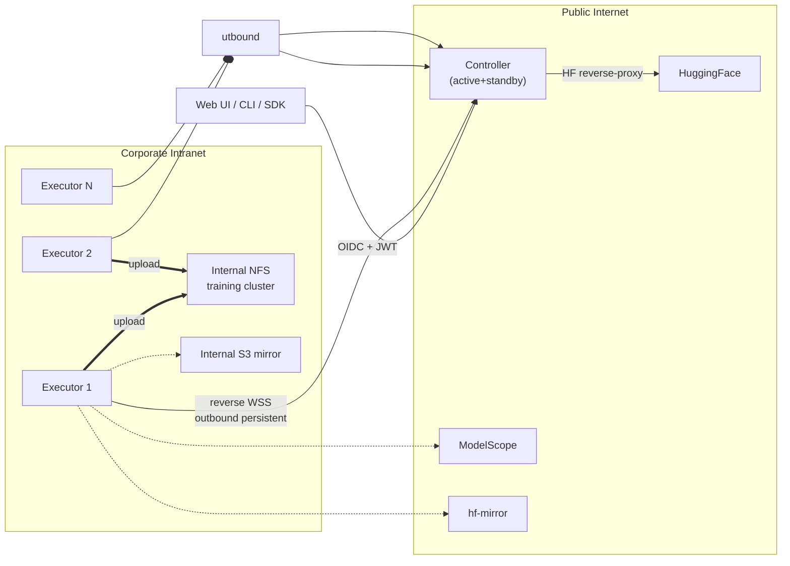

# modelpull

[中文](./README.md) | English

> **📐 Design only — no executable code yet**
> Looking for **design reviewers**, not users. Code work starts at [ROADMAP](./ROADMAP.md) Phase 1.

[](https://github.com/l17728/modelpull/actions/workflows/ci.yml)
[](https://www.apache.org/licenses/LICENSE-2.0)


[](https://github.com/l17728/modelpull/discussions)

⛔ **You cannot download models with this repo yet.** If you came looking for a working
distributed HF download tool, this isn't it.

✅ If you're an **architect / distributed systems enthusiast / SRE / reviewer**, welcome.

📚 **Design output** (~28000 lines / 14 chapters / OpenAPI / Helm + Prometheus + Grafana / 6 runbooks):
- Entry point: [`docs/v2.0/00-INDEX.md`](./docs/v2.0/00-INDEX.md)
- Code work starts after v2.0 GA — see [ROADMAP](./ROADMAP.md)

📌 **Out of scope**: single-machine downloads of small models — [`huggingface_hub.snapshot_download`](https://huggingface.co/docs/huggingface_hub) already handles that.

📌 **In scope**: distributed multi-node / multi-source acceleration / multi-tenancy / corporate intranet deployment / embedded AI Copilot chat / online operations-research optimization.

---

## ⚡ 3 things you can do right now

1. **Read the INDEX** to decide if you want to dive in: [`docs/v2.0/00-INDEX.md`](./docs/v2.0/00-INDEX.md) (5 role-based reading paths)
2. **File a design review issue**: [template](https://github.com/l17728/modelpull/issues/new?template=design_review.yml) — most valuable contribution at this stage
3. **Star + Watch**: get notified when Phase 1 starts

---

## Why this exists

```
DeepSeek-V3 (FP8)            689 GB / 163 files
Kimi-K2-Instruct (FP8)     1,030 GB / 61 files
Qwen3-72B-Instruct (BF16)    144 GB / 30 files
```

Single-machine HF download for these models:
- Outside China: 8-24 hours over a 100Mbps link
- Inside China: HF directly unreachable; mirrors are mandatory
- Single-machine failure / interruption: start over

**Multi-machine parallelism** compresses overall time to **`max(per-machine link / per-source rate-limit)`**.
**Multi-source acceleration** further reduces it to **`total bytes / sum(source bandwidth)`**.

### Why not `huggingface_hub.snapshot_download`?

The most common question first:

| Dimension | `huggingface_hub` | `modelpull` |
|-----------|----------------|-----------|
| Single-file concurrent download | ⚠️ hf_transfer experimental | ✅ DirectOffsetDownloader |
| Multi-machine coordination | ❌ | ✅ Controller + Executor architecture |
| Multi-source (HF/Mirror/ModelScope) | ❌ | ✅ 6 built-in drivers + live probing + LPT |
| Cross-process resumable downloads | ⚠️ filename convention | ✅ DB-persisted + fence token |
| Multi-tenancy / quotas | ❌ | ✅ Tenant/Project/User + RBAC |
| Corporate intranet (NTLM/Kerberos/reverse WSS) | ❌ | ✅ ch.14 §1 |
| Observability (SLO / runbook / chaos) | ❌ | ✅ 5 Grafana / 32 alerts / 6 runbooks |
| Audit / compliance (chained hash + WORM) | ❌ | ✅ ch.04 §9 |
| Online OR-style re-planning | ❌ | ✅ ch.13 §4 |

**Single user, one or two models**: `huggingface_hub.snapshot_download` is lighter.
**Team / platform / many models / large-scale / mainland-China multi-source / corporate intranet**: consider modelpull.

### Architecture (30-second overview)



**Key properties**:

- Executors initiate outbound to Controller (works on corp networks with no inbound port)
- HF Token never leaves Controller (reverse-proxy mode)
- Multiple sources downloaded simultaneously; S3 multipart enables "multi-executor same-file collaboration" without cross-node FS access

---

## Repository structure

```
modelpull/
├── docs/v2.0/                    Design docs (current authoritative)
│   ├── 00-INDEX.md               Navigation + role-based reading paths
│   ├── 01-..14-...               14 chapters
├── docs/operator/                Day-zero / OIDC / mTLS bootstrap
├── docs/getting-started.md       What to do at this stage
├── api/openapi.yaml              OpenAPI 3.1 spec (1900+ lines)
├── deploy/                       Helm + Prometheus + Grafana + 6 runbook scripts
├── tools/                        CI invariant lint (Python)
└── docs/archive/                 v1.x history (superseded)
```

---

## Roles & recommended reading paths

| Role | Path |
|------|------|
| 🏛 Architect / reviewer | `01 → 03 → 04 → 02 → 05 → 06 → 12 → 13 → 14 → 08` |
| 🔨 Backend implementer | `08 → 01 → 02 → 03 → 04 → 13 → 14 → 05 → 07` |
| 🧪 QA | `07 → 02 → 03 → 09 → 12-14` |
| 🛡 Security audit | `04 → 02 → 01 §3 → 05 §10 → 12 §6 → 14 §3` |
| 🚨 SRE / on-call | `05 → 09 → 03 §3 → 04 §6 → 14 §1 → 14 §5` |
| 👤 User / ML engineer | `06 §5 (CLI/SDK) → 02 §1 → 12 §8` |
| 🏗 Platform / integration | `06 → 02 → 04 §1 → openapi.yaml` |
| 📅 PM / Tech Lead | `08 (4 phases) → 07 §8 → 09` |
| 🤖 AI / app dev | `12 → 02 §5 → 04 §6` |
| 📐 Scheduling / algo | `13 → 06 §1.6 §1.8 → 03 §2` |
| 🏢 Intranet / ops | `14 → 04 §3 → 05 §1.2 → 13 §4.1` |

---

## Key features (designed, not yet implemented)

### 🚀 Multi-source orchestration
Built-in drivers: HuggingFace · hf-mirror.com · ModelScope · WiseModel · OpenCSG · self-hosted S3 mirror.
**One-click multi-source acceleration**: live probing → optimal subset selection (LPT) → file-level routing → large-file chunk-level parallel + auto rebalance on degradation.

### 🔒 Distributed correctness
- **Fence token + executor epoch**: prevents double-dispatch / stale executor writes
- **3-way recovery check**: `ListMultipartUploads + ListParts + DB ETag match` before completing multipart
- **Multipart upload_id persistence + standby reconciliation**

### 🛡 Security / multi-tenancy / compliance
- mTLS + executor JWT + heartbeat HMAC
- HF Token reverse-proxy (never leaves Controller)
- 3-tier identity (Tenant / Project / User) + OIDC + RBAC
- License policy / gated approval workflow / pickle interception
- Audit log with chained hash (tamper-evident) + WORM export

### 📊 Production-ready ops
- 4 SLO/SLI definitions
- 32 Prometheus alerts (P0/P1/P2 with hysteresis + inhibit_rules)
- 19 executable runbook scripts
- Active/Standby Controller (RTO ≤ 10min, RPO ≤ 15min)
- Chaos / GameDay drill plan

### 🛠 Platform integration
- CLI (`dlw`) + Python SDK (sync + async)
- HF cache compatibility (set `HF_HOME` to transparently use modelpull)
- Webhook (task.completed / failed)
- MLflow Model Registry auto-registration
- K8s Operator + ModelDownload CRD
- Incremental / diff downloads

### 🤖 AI Copilot (v2.0 shipped)
- Embedded chat drawer: natural-language driven (task ops, HF/ModelScope search, quota mgmt…)
- Backend: **opencode headless only** (modelpull integrates with the opencode CLI; whichever LLM opencode is configured to use is opencode's own concern); stub backend for CI/tests
- Tool bridge: **Skills bridge** (no MCP server) — 18 tools (11 read + 7 write) fed to the LLM via a generated manifest; the LLM picks the right tool from the user's question and shells out to `dlw` CLI or curl. Writes require an in-UI confirmation card; everything audit-logged; full decision chain (thinking + tool_call + tool_result) shown chronologically above the reply.
- Example queries: "what's the latest deepseek on Hugging Face?" / "download deepseek-ai/DeepSeek-R1" / "why did task abcd-1234 fail?"

### 📐 Adaptive download optimization (v2.1)
- Formalized as: `minimize makespan + α × switch_cost`
- Continuous online decisions (30s tick + event-triggered)
- **Sub-chunking** of slow large files via S3 multipart, no cross-node FS access needed
- Hysteresis (CUSUM) prevents thrashing; already-downloaded bytes preserved unless they become bottleneck

### 🏢 Corporate intranet support (v2.1)
- **Reverse control channel**: executor opens persistent WSS outbound (passes through corp proxy); controller pushes commands sub-second
- **Rate-limit dimension probing**: auto-detect per-connection / per-IP / per-user
- **Local credential pool**: secrets never leave executor; controller knows aliases only
- **Live Console**: admin real-time log streaming UI

---

## Status

✅ **Done**:
- 28000+ lines of design + deployment artifacts
- Complete OpenAPI 3.1 spec
- 3 rounds of multi-agent review; ~150 issues fixed across 6 PRs
- 4-Phase 15-week implementation roadmap (P90 18-19 weeks)
- v1.x → v2.0 data migration plan
- Helm chart + Prometheus alerts + Grafana dashboards + 7 runbook scripts
- CI invariant lint with 9 unit tests

🚧 **Not started**:
- Backend code (Python + FastAPI + SQLAlchemy)
- Frontend code (Vue 3 + Pinia + Element Plus)
- CLI / Python SDK implementation
- E2E tests + chaos drill execution

---

## Roadmap

See [ROADMAP.md](./ROADMAP.md) for current phase status.

| Version | Content |
|---------|---------|
| **v2.0** (design complete) | Single-tenant → distributed → multi-tenant + multi-source → production hardening (4 phases / 15 weeks) |
| v2.1 | **AI Copilot first-class** + **adaptive optimization** + **enterprise intranet** + cross-region replication + SLA tiers + offline export bundle |
| v2.2+ | Active-active controller / federated cross-cluster / PRC self-hosted LLM / Sigstore verification / model online quantization |

---

## Contributing

See [CONTRIBUTING.md](./CONTRIBUTING.md). At this stage the most valuable contribution is **design review**:

- 🐛 [Bug Report](https://github.com/l17728/modelpull/issues/new?template=bug_report.yml)
- ✨ [Feature Request](https://github.com/l17728/modelpull/issues/new?template=feature_request.yml)
- 🏛 [Design Review](https://github.com/l17728/modelpull/issues/new?template=design_review.yml) — **most valuable now**

Discussions: [GitHub Discussions](https://github.com/l17728/modelpull/discussions)

---

## License

[Apache License 2.0](./LICENSE)
