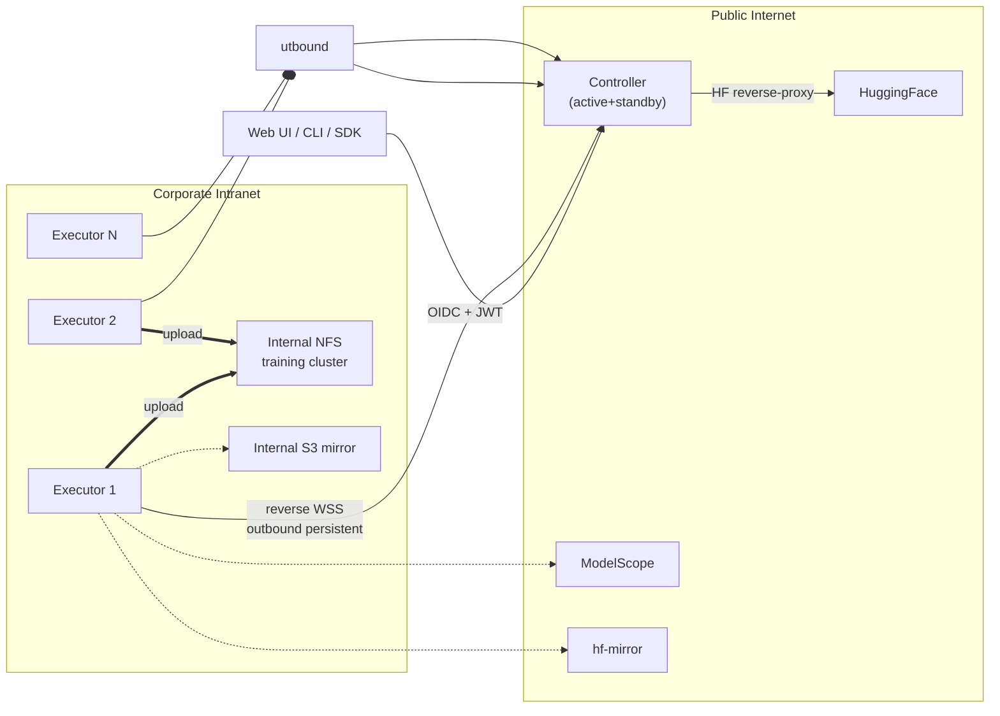

# modelpull

[中文](./README.md) | English

> **✅ Shipped & runnable** — v2.0 (Phase 1/2/3) + **all 15 v2.1 sprints** are implemented and merged to main, tagged **v2.1.0-rc.1** (2026-05-27, 1053 backend + 219 frontend tests, CI green).
> Run it locally: controller + executor + object storage, and download real HF models via CLI/SDK.
> Get started: [**`docs/getting-started.md`**](./docs/getting-started.md).

[](https://github.com/l17728/modelpull/actions/workflows/ci.yml)
[](https://www.apache.org/licenses/LICENSE-2.0)


[](https://github.com/l17728/modelpull/discussions)

✅ A **distributed HuggingFace model-weight download system**: controller orchestration, parallel multi-executor downloads, multi-source acceleration, multi-tenant isolation, incremental dedup — writing to S3-compatible object storage.

📚 **Design authority** (~28000 lines / 14 chapters / OpenAPI / Helm + Prometheus + Grafana / 6 runbooks):
- Entry point: [`docs/v2.0/00-INDEX.md`](./docs/v2.0/00-INDEX.md)

📌 **Out of scope**: single-machine downloads of small models — [`huggingface_hub.snapshot_download`](https://huggingface.co/docs/huggingface_hub) already handles that.

📌 **In scope**: distributed multi-node / multi-source acceleration / multi-tenancy / incremental dedup / CLI+SDK / embedded AI Copilot (v2.0) / adaptive OR optimization + cross-region replication + SLA tiers + corporate intranet deployment (**v2.1 shipped**).

---

## ⚡ 3 things you can do right now

1. **Run it locally**: follow [`docs/getting-started.md`](./docs/getting-started.md) to bring up controller + executor + minio, then `dlw submit` a real model
2. **Read the architecture**: [`docs/v2.0/00-INDEX.md`](./docs/v2.0/00-INDEX.md) (14 chapters / 5 role-based reading paths)
3. **File an issue**: [design review template](https://github.com/l17728/modelpull/issues/new?template=design_review.yml) — architecture/protocol/correctness feedback still welcome

---

## Why this exists

```
DeepSeek-V3 (FP8)            689 GB / 163 files
Kimi-K2-Instruct (FP8)     1,030 GB / 61 files
Qwen3-72B-Instruct (BF16)    144 GB / 30 files
```

Single-machine HF download for these models:
- Outside China: 8-24 hours over a 100Mbps link
- Inside China: HF directly unreachable; mirrors are mandatory
- Single-machine failure / interruption: start over

**Multi-machine parallelism** compresses overall time to **`max(per-machine link / per-source rate-limit)`**.
**Multi-source acceleration** further reduces it to **`total bytes / sum(source bandwidth)`**.

### Why not `huggingface_hub.snapshot_download`?

The most common question first:

| Dimension | `huggingface_hub` | `modelpull` |
|-----------|----------------|-----------|
| Single-file concurrent download | ⚠️ hf_transfer experimental | ✅ DirectOffsetDownloader |
| Multi-machine coordination | ❌ | ✅ Controller + Executor architecture |
| Multi-source (HF/Mirror/ModelScope) | ❌ | ✅ 6 built-in drivers + live probing + LPT |
| Cross-process resumable downloads | ⚠️ filename convention | ✅ DB-persisted + fence token |
| Multi-tenancy / quotas | ❌ | ✅ Tenant/Project/User + RBAC |
| Corporate intranet (NTLM/Kerberos/reverse WSS) | ❌ | ✅ ch.14 §1 |
| Observability (SLO / runbook / chaos) | ❌ | ✅ 5 Grafana / 32 alerts / 6 runbooks |
| Audit / compliance (chained hash + WORM) | ❌ | ✅ ch.04 §9 |
| Online OR-style re-planning | ❌ | ✅ ch.13 §4 |

**Single user, one or two models**: `huggingface_hub.snapshot_download` is lighter.
**Team / platform / many models / large-scale / mainland-China multi-source / corporate intranet**: consider modelpull.

### Architecture (30-second overview)



**Key properties**:

- Executors initiate outbound to Controller (works on corp networks with no inbound port)
- HF Token never leaves Controller (reverse-proxy mode)
- Multiple sources downloaded simultaneously; S3 multipart enables "multi-executor same-file collaboration" without cross-node FS access

---

## Repository structure

```
modelpull/
├── src/dlw/                      👈 implementation (shipped)
│   ├── main.py                   FastAPI app + leader-gated lifespan
│   ├── api/ auth/ authz/ db/     REST + system-JWT/OIDC + mTLS CA + casbin + SQLAlchemy
│   ├── services/                 scheduler / multi-source / dedup / recovery / quota / leader
│   │                             + v2.1: replication / optimizer / replan / credential_pool / reverse_ws
│   ├── sources/ executor/        SourceDriver + NameResolver · runner / client / downloader / cli
│   └── sdk/ cli/                 Python SDK (sync+async) · dlw CLI
├── tests/                        1053 backend tests (api/db/services/e2e/sdk/cli/integration/...)
├── frontend/                     Vue3 SPA (219 unit tests)
├── docs/v2.0/                    Design authority — 00-INDEX.md + 14 chapters
├── docs/operator/                Day-zero / OIDC / mTLS / deployment / load-test / chaos runbooks
├── docs/getting-started.md       User manual (install / deploy / use)
├── api/openapi.yaml              OpenAPI 3.1 spec
├── deploy/                       Helm + Prometheus + Grafana + 6 runbooks + loadtest + single-host compose
├── tools/                        CI invariant lint (Python)
└── docs/archive/                 v1.x history (superseded)
```

---

## Roles & recommended reading paths

| Role | Path |
|------|------|
| 🏛 Architect / reviewer | `01 → 03 → 04 → 02 → 05 → 06 → 12 → 13 → 14 → 08` |
| 🔨 Backend implementer | `08 → 01 → 02 → 03 → 04 → 13 → 14 → 05 → 07` |
| 🧪 QA | `07 → 02 → 03 → 09 → 12-14` |
| 🛡 Security audit | `04 → 02 → 01 §3 → 05 §10 → 12 §6 → 14 §3` |
| 🚨 SRE / on-call | `05 → 09 → 03 §3 → 04 §6 → 14 §1 → 14 §5` |
| 👤 User / ML engineer | `06 §5 (CLI/SDK) → 02 §1 → 12 §8` |
| 🏗 Platform / integration | `06 → 02 → 04 §1 → openapi.yaml` |
| 📅 PM / Tech Lead | `08 (4 phases) → 07 §8 → 09` |
| 🤖 AI / app dev | `12 → 02 §5 → 04 §6` |
| 📐 Scheduling / algo | `13 → 06 §1.6 §1.8 → 03 §2` |
| 🏢 Intranet / ops | `14 → 04 §3 → 05 §1.2 → 13 §4.1` |

---

## Key features

> Legend: unmarked = **✅ shipped in v2.0** (Phase 1/2/3); **(v2.1)** = **✅ shipped in v2.1** (15 sprints, v2.1.0-rc.1).

### 🚀 Multi-source orchestration
Built-in drivers: HuggingFace · hf-mirror.com · ModelScope · WiseModel · OpenCSG · self-hosted S3 mirror.
**One-click multi-source acceleration**: live probing → optimal subset selection (LPT) → file-level routing → large-file chunk-level parallel + auto rebalance on degradation.

### 🔒 Distributed correctness
- **Fence token + executor epoch**: prevents double-dispatch / stale executor writes
- **3-way recovery check**: `ListMultipartUploads + ListParts + DB ETag match` before completing multipart
- **Multipart upload_id persistence + standby reconciliation**

### 🛡 Security / multi-tenancy / compliance
- mTLS + executor JWT + heartbeat HMAC
- HF Token reverse-proxy (never leaves Controller)
- 3-tier identity (Tenant / Project / User) + OIDC + RBAC
- License policy / gated approval workflow / pickle interception
- Audit log with chained hash (tamper-evident) + WORM export

### 📊 Production-ready ops
- 4 core SLI/SLO definitions
- 20+ Prometheus alerts (P0/P1/P2 with hysteresis + inhibit_rules)
- 6 executable runbook scripts (+ v2.1 chaos-drill plan)
- Active/Standby Controller (RTO ≤ 10min, RPO ≤ 15min)
- Chaos / GameDay drill plan

### 🛠 Platform integration
- CLI (`dlw`) + Python SDK (sync + async)
- HF cache compatibility (set `HF_HOME` to transparently use modelpull)
- Webhook (task.completed / failed)
- MLflow Model Registry auto-registration
- K8s Operator + ModelDownload CRD
- Incremental / diff downloads

### 🤖 AI Copilot (v2.0 shipped)
- Embedded chat drawer: natural-language driven (task ops, HF/ModelScope search, quota mgmt…)
- Backend: **opencode headless only** (modelpull integrates with the opencode CLI; whichever LLM opencode is configured to use is opencode's own concern); stub backend for CI/tests
- Tool bridge: **Skills bridge** (no MCP server) — 18 tools (11 read + 7 write) fed to the LLM via a generated manifest; the LLM picks the right tool from the user's question and shells out to `dlw` CLI or curl. Writes require an in-UI confirmation card; everything audit-logged; full decision chain (thinking + tool_call + tool_result) shown chronologically above the reply.
- Example queries: "what's the latest deepseek on Hugging Face?" / "download deepseek-ai/DeepSeek-R1" / "why did task abcd-1234 fail?"

### 📐 Adaptive download optimization (v2.1 ✅ shipped)
- Chunk-throughput sampler feeds an LPT + local-swap optimizer (zero-dependency heuristic; highspy/MILP path isolated)
- Online replan loop with shadow + apply dual mode (two feature flags, default off for safe rollout)
- **Sub-chunking** of slow large files via S3 multipart, no cross-node FS access needed
- 2 Prometheus metrics (solve-duration histogram + replan-moves counter)

### 🏢 Corporate intranet support (v2.1 ✅ shipped)
- **Reverse control channel**: executor opens persistent WSS outbound (passes through corp proxy); controller pushes commands sub-second (at-least-once + reconnect-resend)
- **Local credential pool**: Fernet envelope encryption with hot key reload; secrets never leave executor; controller knows aliases only
- **Live Console**: admin real-time command (whitelisted status/drain/restart) + session listing

### 🎚 SLA tiers + 🌐 cross-region replication + 🗑 physical GC (v2.1 ✅ shipped)
- **SLA tiers** (`critical`/`standard`/`bulk`): weighted scheduling + admission control + Settings UI
- **Cross-region replication**: `replication_jobs` + streaming worker (sha verify + retry + bandwidth cap) + `/replication` UI + AI tool + Prometheus/Grafana
- **Physical GC + LRU eviction**: real object-store byte deletion on top of v2.0 refcount tombstones + `/admin/gc` REST (flag-gated)

---

## Status

✅ **Shipped & merged (v2.0 Phase 1/2/3)**:
- **Phase 1** foundation: FastAPI controller + PG schema + scheduler/state machine + real HF→S3 multipart download (PR #1–#6)
- **Phase 2** distributed correctness: fence/recovery, chunk downloader, cancel/paused, mTLS + executor-JWT + heartbeat HMAC, HF reverse-proxy, active/standby controller (PR #7–#14)
- **Phase 3** platform: multi-tenancy (OIDC/RBAC/quota/tenant isolation), multi-source (probing + LPT + chunk routing + blacklist), incremental download + global dedup (refcount/GC), `dlw` CLI + Python SDK sync/async (PR #15–#18)
- Complete OpenAPI 3.1 spec, Helm chart, Prometheus alerts, Grafana dashboards, 6 runbook scripts

✅ **Shipped & merged (v2.1, 15 sprints → v2.1.0-rc.1, 2026-05-27)**:
- **SLA tiers** (S1), **Physical GC + LRU** (S3), **cross-region replication** (S4–S6)
- **adaptive OR optimization** (S7–S9): sampler + optimizer + shadow/apply online replan (flag-gated)
- **corporate intranet** (S10–S13): reverse WSS + RPC dispatch + credential pool envelope encryption + Live Console
- **cross-feature integration** (S14, 12 scenarios) + **production-deploy artifacts** (S15: Locust 7-day load test + chaos drills)
- **1053 backend + 219 frontend tests green, CI green throughout**

🚧 **Remaining for GA (operational only, no code)**:
- 7-day Locust staging run (`deploy/loadtest/`) with all 4 acceptance gates met
- 4 chaos drills (`deploy/runbooks/chaos-drill.md`) repeated green
- Fill `docs/operator/sla-slo.md` § 3 capacity baseline with measured numbers → then tag **v2.1.0 GA**

---

## Roadmap

| Version | Content | Status |
|---------|---------|--------|
| **v2.0** | Single-tenant → distributed correctness → multi-tenant + multi-source → incremental dedup → CLI/SDK | ✅ **shipped & merged** (Phase 1/2/3, PR #1–#18) |
| **v2.1** | SLA tiers + Physical GC/LRU + cross-region replication + adaptive OR optimization + corporate intranet (reverse WSS / credential pool / Live Console) | ✅ **shipped & merged** (15 sprints → **v2.1.0-rc.1**; GA pending 7-day staging baseline) |
| v2.2 | Active-active controller + Sigstore verification + model online quantization + BLAKE3 streaming hash | 📐 design |
| v2.3 | Multi-controller cluster (sharded by tenant) | 📐 design |

---

## Contributing

See [CONTRIBUTING.md](./CONTRIBUTING.md). Architecture / protocol / invariant review is always welcome:

- 🐛 [Bug Report](https://github.com/l17728/modelpull/issues/new?template=bug_report.yml)
- ✨ [Feature Request](https://github.com/l17728/modelpull/issues/new?template=feature_request.yml)
- 🏛 [Design Review](https://github.com/l17728/modelpull/issues/new?template=design_review.yml)

Discussions: [GitHub Discussions](https://github.com/l17728/modelpull/discussions)

---

## License

[Apache License 2.0](./LICENSE)
