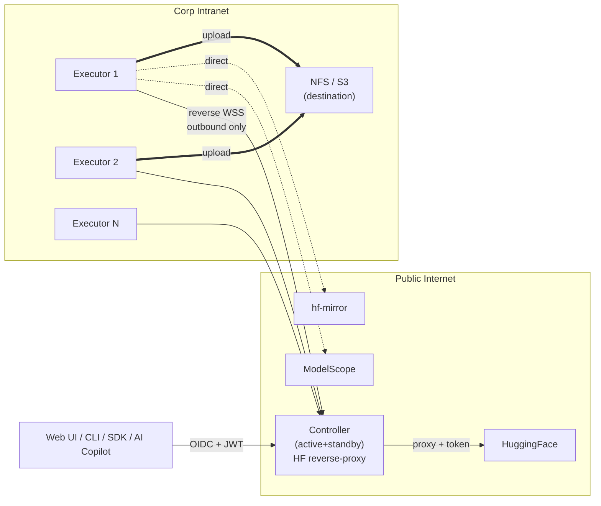

# 00 — Overview（1.5 小时入门版）

> **目的**：让新读者用 1.5 小时（vs 完整 14 章 24-32 小时）建立 modelpull 的全局 mental model。
> **不替代** [`00-INDEX.md`](./00-INDEX.md) 的角色阅读路径；本文是**第一站**，读完后再深入感兴趣的章节。
>
> 解决 round 3 reviewer DOC-01：架构师路径 9500 行入门门槛过高。

---

## 1. 一句话定位

modelpull 是**面向团队的分布式 HuggingFace 模型权重下载系统**，目标场景：
TB 级模型（DeepSeek-V3 689 GB / Kimi-K2 1 TB）+ 多机并行 + 多源加速 + 企业内网部署 + 多租户。

**不是**：单机小模型下载（用 `huggingface_hub.snapshot_download` 就够了）。

---

## 2. 系统全貌（30 秒看图）

**5 个关键流向**：

1. **用户 → Controller**：OIDC 登录 + 多租户隔离（详见 04 §1）
2. **Executor → Controller**：内网出站，反向 WSS 长连（详见 14 §1）
3. **Controller → HF**：HF Token reverse-proxy，token 不下发（不变量 2）
4. **Executor → 其他 source**：直连（如 ModelScope）；STS 临时凭证下发
5. **Executor → NFS/S3**：上传目的地；S3 multipart 支持多 executor 同文件协作（详见 13 §5）

---

## 3. 5 个最重要的设计决策

### 3.1 Controller-Executor 分离 + 反向 WSS

**Why**：corp 内网无入站 IP；Executor 主动连出符合 corp gateway 模型。
**How**：Executor 持久化 WSS 出站连 Controller；命令推送 1s 内到达（vs 10s heartbeat polling）。
**详见**：14 §1 + 02 §4。

### 3.2 Fence Token + Executor Epoch

**问题**：分布式调度的"陈旧 executor 接受新任务"导致双发。
**解法**：
- Executor Epoch（单调递增；register 时分配）
- Assignment Token（每次 assign 生成 fresh UUID）
- Controller 写入时 `WHERE epoch=? AND token=?` fence
**详见**：03 §2 + 不变量 6, 9, 27, 35。

### 3.3 多源 LPT + 子分片 + S3 Multipart

**问题**：单源限速；HF 跨境慢。
**解法**：
- 启动时实时测速所有源（5-15s）
- LPT 启发式选最优组合（不是全用，避免引入慢源摊薄）
- 大文件（≥100 MB）切 sub-chunk 给多 executor，**通过 S3 multipart upload 协议拼装**（无需跨节点 FS 访问）
**详见**：06 §1 + 13 §1 + 13 §5。

### 3.4 在线运筹优化（adaptive replan）

**问题**：source 速度抖动；executor 故障；新 executor 加入。
**解法**：
- 30s 周期 + 事件触发（hard / soft / periodic 三级）
- 形式化：`min makespan + α × switch_cost`
- Hysteresis（CUSUM）防抖动；已下载默认不丢
**详见**：13 §1, §4。

### 3.5 不变量驱动 + CI 强制

**问题**：分布式系统正确性难维护；文档与代码漂移。
**解法**：
- 46 条 invariants 集中索引（01 §7 → 也见 [`INVARIANTS.md`](./INVARIANTS.md)）
- `tools/lint_invariants.py` CI 强制检查编号唯一 + 索引一致 + cross-ref 不破
- 每条不变量必有验证方式（单测 / 集成 / 配置 lint）
**详见**：01 §7 + tools/lint_invariants.py。

---

## 4. 读者路径快速决策

| 你是谁 | 优先读哪 1 章 | 然后看 |
|--------|-------------|--------|
| 想快速了解整体 | **本文 (Overview)** | 完成 ✅ |
| 写后端代码的 | [`01-architecture.md`](./01-architecture.md) | `08-mvp-roadmap.md` Phase 1 入场 |
| 写前端 / SDK 的 | [`02-protocol.md`](./02-protocol.md) §2 | `api/openapi.yaml` |
| QA / 测试 | [`07-test-plan.md`](./07-test-plan.md) §0 测试金字塔 | 各章节 §测试 |
| SRE / on-call | [`05-operations.md`](./05-operations.md) §4 Runbook | `09-migration.md` |
| 安全审计 | [`04-security-and-tenancy.md`](./04-security-and-tenancy.md) | [`INVARIANTS.md`](./INVARIANTS.md) Group B 安全 |
| 调度 / 算法 | [`13-adaptive-download-optimization.md`](./13-adaptive-download-optimization.md) | `06 §1.6 §1.8` |
| 内网部署 | [`14-enterprise-network-and-rate-limit.md`](./14-enterprise-network-and-rate-limit.md) | `docs/operator/onboard-first-executor.md` |
| AI 应用 | [`12-ai-copilot.md`](./12-ai-copilot.md) | `04 §6` 安全 |
| PM / Tech Lead | [`08-mvp-roadmap.md`](./08-mvp-roadmap.md) | `09-migration.md` |
| 产品 | [`README.md`](../../README.md) | [`ROADMAP.md`](../../ROADMAP.md) |

---

## 5. 6 个关键不变量（46 条精选）

> 完整 46 条 → [`INVARIANTS.md`](./INVARIANTS.md)（按 5 主题分组）。
> 这里给最影响 mental model 的 6 条：

| # | 内容 | Why 你必须知道 |
|---|------|--------------|
| **2** | Tenant-级 HF Token 不离开 Controller | 凭证安全模型的核心；Executor 调 HF 必经 reverse-proxy |
| **5** | 任务级最终校验比对**所有** subtask 的 sha256（不仅 size） | v1.x 老 bug 修复；不允许"差不多就行" |
| **6** | `assigned → downloading` 必带 assignment_token | fence token 防双发的核心 |
| **20** | 已下载字节默认不参与重新规划（除非成为瓶颈） | adaptive optimizer 的稳定性来源 |
| **22** | 子分片必满足 S3 multipart 约束（5MB-5GB / part ≤10000） | 决定哪些 storage backend 支持子分片 |
| **42** | PlanOptimizer decide+apply+reclaim 必须同 SCHEDULER_LOCK | 防 generation race |

---

## 6. 14 章地图（一句话总结每章）

| 章 | 一句话 | 行数 | 必读？ |
|----|--------|------|------|
| 01 | 架构 + 状态机 + 数据模型权威定义 | 950 | ✅ 全员 |
| 02 | API + 心跳 + WS 协议契约 | 770 | 实现 SDK / 集成方 |
| 03 | Fence token + 恢复语义 + crash-consistency | 950 | 后端实现 |
| 04 | 认证 / 多租户 / 配额 / 合规 / 审计 | 800 | 安全 / 平台 |
| 05 | SLO / Runbook / 备份 / 灰度 / 容量 | 1100 | SRE / on-call |
| 06 | 多源 + 增量 + CLI + 集成 + Roadmap | 1030 | 产品 / 生态 |
| 07 | ~870 测试矩阵 | 870 | QA |
| 08 | 4 Phase / 15 周 / FTE 表 | 530 | PM / Tech Lead |
| 09 | v1.x → v2.0 数据迁移 + alembic | 800 | DBA / SRE |
| 10 | 9 页 wireframe + Vue3 组件 | 780 | 前端 / UI |
| 11 | dlw CLI + Python SDK 规范 | 690 | CLI/SDK / 用户 |
| 12 | AI Copilot 嵌入聊天 + MCP（v2.1） | 950 | AI 应用 |
| 13 | 在线运筹优化 + 子分片 + S3 协作（v2.1） | 1080 | 算法 / 调度 |
| 14 | 内网 / 限速探测 / 凭证池 / Console（v2.1） | 1130 | 内网部署 / 运维 |

---

## 7. 读完 Overview 后

✅ **现在你能**：
- 画出系统全貌（5 个流向）
- 解释 fence token 防双发的核心思想
- 决定下一步深入哪一章
- 告诉别人 modelpull 与 huggingface_hub 的差异

🚀 **去哪里**：
- 角色路径见 [`00-INDEX.md`](./00-INDEX.md) §按角色推荐阅读路径
- 概念查询见 [`GLOSSARY.md`](./GLOSSARY.md)
- 不变量索引见 [`INVARIANTS.md`](./INVARIANTS.md)
- 实施 roadmap 见 [`08-mvp-roadmap.md`](./08-mvp-roadmap.md) + [`../../ROADMAP.md`](../../ROADMAP.md)
- 现在能跑什么见 [`../getting-started.md`](../getting-started.md)
