# Invariants — 46 条核心约束（按主题分组）

> 解决 round 3 reviewer DOC-02：原 01 §7 单表 46 条已撑爆。本文按 5 主题分组 + 依赖 DAG + Anti-example 提示。
> CI lint：[`tools/lint_invariants.py`](../../tools/lint_invariants.py) 强制编号唯一 + 索引完整。

---

## 0. 索引规约

- **ID**：1-46，全局唯一，CI 强制
- **Tier**：🔴 数据完整性 / 🛡 安全 / 🔒 一致性 / 📐 调度 / ⚙️ 治理
- **Verified by**：单测 / 集成 / E2E / 配置 lint / 进程审计
- **Depends on**：本不变量预设了哪些其他不变量成立（用于推理依赖图）
- **Anti-example**：违反时的具体反例 / 失败模式

> 表中"详细"列指向**权威定义**章节。如有多处提及，权威定义为准。

---

## A. 数据完整性 (5 条) 🔴

> 这一组是"数据安全"的最后一道防线。任何违反都意味着用户拿到错的模型 / 多 multipart upload 失败 / 备份不可用。

| ID | 内容 | 详细 | Depends on | Anti-example | Verified by |
|----|------|------|------------|--------------|-------------|
| **5** | 任务级最终校验必须比对所有 subtask `expected_sha256 == actual_sha256`（不仅 size） | 03 §6 | — | size 对但 sha 不对的"似乎完成"任务被标 verified | 单测 + E2E |
| **11** | HF 永远是 SHA256 真值来源 | 06 §1.2 | — | 别的 source 给的 sha 与 HF 不一致 → 接受 = 错 | 多源测试 |
| **12** | 跨源下载完成后必须比对 HF sha256 | 06 §1 | 11 | sha 不匹配但不黑名单 → 重复污染 | E2E + chaos |
| **13** | HF 不可用时默认拒绝下载（除非用户 explicit `trust_non_hf_sha256`） | 06 §1.13 | 11, 12 | HF down 期间用其他源 sha → 真值丢失 | 故障注入 |
| **14** | `(tenant_id, repo_id, revision, filename, sha256)` 在存储中只存一份 | 06 §3 | — | 重复存浪费空间 + refcount 错乱 | DB UNIQUE + GC 测试 |

---

## B. 安全 / 多租户 (16 条) 🛡

> 凭证管理 / RBAC / 审计 / 数据出境的硬约束。任何违反都是合规事件。

| ID | 内容 | 详细 | Depends on | Anti-example | Verified by |
|----|------|------|------------|--------------|-------------|
| **1** | UI 永不直连 HF API | 04 §3.1 | — | UI 持 HF Token → XSS 攻击窃取 | 网络策略 + UI 静态扫描 |
| **2** | Tenant-级 HF Token 不离开 Controller（reverse-proxy）；Executor-本地 OOB token 池为例外 | 04 §3.1 | — | Token 在 wire 上明文 → wire-tap 泄漏 | 代码 lint |
| **3** | Executor 不持长期 storage 凭证 | 04 §3.2 | — | Executor 被攻破 → S3 bucket 全失 | 配置扫描 |
| **4** | Controller 不主动反向连接 Executor | 14 §1 | — | Executor 必须暴露端口 → corp 内网部署不可行 | 网络策略 |
| **8** | 业务表必须有 `tenant_id` | 01 §4 | — | 多租户隔离失效 → 数据互相可见 | information_schema 扫描 |
| **15** | AI Copilot 不能超越调用用户的 RBAC 权限 | 12 §6 | — | AI 用 system token 越权操作 | AI 注入测试 |
| **16** | 所有 AI 触发的写操作必须写 audit_log（含 LLM final message + rejected confirm） | 12 §6.3 | — | AI 写操作不可追溯 | 审计完整性 |
| **17** | AI 写操作必须用户 confirm；read-only 工具可免确认 | 12 §6 | 15 | AI 自主创建任务 → 配额耗尽 | 协议测试 |
| **18** | LLM token 配额与下载流量配额隔离 | 12 §7 | — | AI cost 失控影响下载预算 | quota 单测 |
| **19** | 任何外部 origin 字段必须 sanitize（NFKC + Cf + confusables） | 12 §6.1 | — | Unicode zero-width 注入绕过检测 | 11 sanitize 单测 |
| **30** | 执行器本地凭证不出本机；controller 仅知 alias | 14 §3.1 | 2 | Controller 被攻破 → 全套 corp 凭证泄漏 | 配置审计 + 进程内存扫描 |
| **31** | alias 删除走 drain → purge 两阶段；不强制中断 in-flight | 14 §3.6 | 30 | alias 立刻 purge → in-flight chunk 被强杀 + 抖动循环 | 凭证轮换测试 |
| **36** | 外部内容必须 NFKC + Cf 移除 + confusables + 语义模式 sanitize | 12 §6.1 | 19 | Unicode 攻击绕过 | sanitize 单测 |
| **37** | MCP server 沙箱进程不继承 controller 敏感凭证内存 | 12 §2.2 | — | MCP tool bug → controller RCE → KEK 泄漏 | 进程内存扫描 |
| **41** | T2（用户内容）必须 `<external_user_content trust_level="t2">` 边界化 + 8KB 截断 | 12 §3.3 | 19, 36 | T2 内容混入 system prompt 区域 | sanitize 单测 |
| **44** | mTLS server cert fingerprint 不匹配时 fail-fast | 14 §1.5 | — | SSL inspection 静默接受 → 中间人 | E2E SSL inspection |
| **45** | cn zone tenant 在 v2.1 GA 期间不允许调 AI Copilot；zone 切换需 MFA + 审计 | 12 §11.3 | 16 | 数据出境合规违规 | API 中间件 + audit |

---

## C. 一致性 / Fence Token (12 条) 🔒

> 防止双发、stale write、split-brain 的核心。这一组失败 = silent 数据错误。

| ID | 内容 | 详细 | Depends on | Anti-example | Verified by |
|----|------|------|------------|--------------|-------------|
| **6** | `assigned → downloading` 必带 assignment_token | 03 §2 | 9 | 无 token 则 stale executor 可写入 | API 测试 |
| **7** | Executor 状态 transition 写 `executor_status_history` | 01 §3.3 | — | 历史不可追溯，调试困难 | DB trigger / 单测 |
| **9** | `(executor_id, epoch)` 是因果时钟 | 03 §2 | — | 无 epoch → reclaim 后旧 executor 写入旧 chunk | API 测试 |
| **26** | sub-chunk 的 `s3_part_number` 在 multipart_upload 内首次分配后稳定，仅 reclaim 时 bump | 13 §5.4 | 9 | 直接复用 part_number → S3 last-write-wins race | 恢复测试 |
| **27** | Hard trigger 不被 cooldown 抑制 | 13 §4.3 | — | bottleneck 速度跌 cooldown 内不触发 → makespan 退化 | trigger 单测 |
| **28** | 反向 WSS 通道与 HTTPS 心跳通道使用同一组 mTLS + JWT 凭证 | 14 §1.5 | — | 双套凭证维护 → 不同步出 bug | 通道单测 |
| **32** | multipart_upload_id 必须在 PG commit 后才推送到 executor（CAS-then-enqueue） | 13 §5.1 | — | DB rollback 但 executor 已开始 → 孤儿 upload | DIST-V21-01 单测 |
| **33** | standby 提升后进入 recovery_in_progress；所有心跳响应 503 直到三向对账完成 | 13 §5.4 | — | 接管后立即接收新心跳 → 状态污染 | DIST-V21-08 集成 |
| **34** | s3:CompleteMultipartUpload 前必须 ListParts 严格匹配 DB 期望 ETag 集合 | 13 §5.5 | 26 | ETag 不匹配 → InvalidPart 报错 | DIST-V21-02 单测 |
| **35** | 每条 WSS push 必含 `target_executor_epoch`；mismatch 时 close 重连 | 14 §1.2 | 9, 28 | 旧 ws_session 收到新命令 → split-brain | DIST-V21-03 集成 |
| **39** | Conversation context 严格 per-conversation 构建；不跨 conversation 拼接 history / summary | 12 §6.2 | 15 | LLM context 跨 conv 串味 → ID 泄漏 | AI-SEC-MT-005 |
| **40** | `modified_input` 必须重跑全部 service-layer 前置校验 | 12 §4.2 | 17 | AI 中间结论被绕过 → license 违规 | 单测 |
| **42** | PlanOptimizer decide+apply+reclaim push 必须同 SCHEDULER_LOCK | 13 §4.3.4 | 9 | apply 阶段 race → generation 错乱 | DIST-V21-04 集成 |
| **43** | 同时只有 1 个 controller 是 probe leader；集群级 5GB/天总预算 | 14 §2.3 | — | 多 controller 同时探测 → 互相挤占 + 预算爆 | DIST-V21-05 集成 |

---

## D. 调度 / 优化 (8 条) 📐

> Adaptive optimizer 的稳定性、收敛性、效率约束。

| ID | 内容 | 详细 | Depends on | Anti-example | Verified by |
|----|------|------|------------|--------------|-------------|
| **10** | 同一文件的多 chunk 不分给同 host_id 下不同 executor | 01 §5.3 | — | NIC 共享导致 thrash | 调度器单测 |
| **20** | 已下载字节默认不参与重新规划（除非该文件成为 makespan 瓶颈或切换收益 ≥50%） | 13 §2.1 | — | 激进切换 → 重下浪费带宽 | 决策回放 |
| **21** | 优化决策必须有 hysteresis（CUSUM 优于硬阈值） | 13 §2.1 | — | 无 hysteresis → 速度抖动期循环切换 | 抖动测试 |
| **22** | 子分片必满足 S3 multipart 约束（part 5MB-5GB / 总数 ≤10000）；非 S3 backend 走 single-executor 拼装或 S3 staging | 13 §5.5 | — | 不满足约束 → S3 直接 reject | 配置 lint |
| **23** | 每次重新规划写 `optimization_decisions` 表（输入 + 决策 + 预期 + 实际） | 13 §6.5 | 8 | 决策不可回放 → 算法 review 不可能 | DB 单测 |
| **24** | v2.1 单任务最优化（含轻量 round-robin 公平兜底）；跨任务全局 LP 推 v2.2 | 13 §2.1 | — | 跨任务全局 LP 在 v2.1 引入 → 复杂度爆 | scope 限制 + mypy |
| **25** | 单次决策 ≤ 5s（超时回退 fast path 启发式） | 13 §4.2 | — | LP 阻塞 → 心跳处理积压 | 性能基线 |
| **38** | Slow path 连续超时 ≥ 3 次自动降级 LP 松弛 + anytime；不允许永久 fallback fast path | 13 §9.1 | 25 | 算法形同虚设 | OR-V21-03 集成 |

---

## E. 治理 (5 条) ⚙️

> 工程实践 / 容量 / 数据合规的强约束。

| ID | 内容 | 详细 | Depends on | Anti-example | Verified by |
|----|------|------|------------|--------------|-------------|
| **29** | 子分片策略必须考虑限速画像（per-conn / per-IP / per-user）；维度未知时不盲目并发 | 14 §2.5 | 22 | 错估维度 → 16 conn 抢同一 IP 池徒劳 | 限速联动测试 |
| **46** | P-011 1000-executor 容量测试是 GA 阻断项 | 07 §4.3 | — | 不通过则推迟 GA 或下调 SLO | Phase 4 必跑 |

> 治理类的不变量较少；大部分治理通过 PR template + CI workflow + 流程文档实现。

---

## 6. 不变量依赖 DAG（DOC-10）

```mermaid
flowchart TD
    %% Group A: 数据完整性
    inv5["#5 任务级 sha 校验"]:::dataint
    inv11["#11 HF 是 sha 真值"]:::dataint
    inv12["#12 跨源 sha 比对"]:::dataint
    inv13["#13 HF 不可用拒下"]:::dataint
    inv14["#14 存储去重"]:::dataint

    %% Group B: 安全
    inv1["#1 UI 不连 HF"]:::sec
    inv2["#2 HF Token 不离开 Controller"]:::sec
    inv3["#3 Executor 无长期凭证"]:::sec
    inv4["#4 Controller 不反连"]:::sec
    inv8["#8 业务表必带 tenant_id"]:::sec
    inv15["#15 AI 不超越用户权限"]:::sec
    inv16["#16 AI 写操作 audit"]:::sec
    inv17["#17 AI 写需 confirm"]:::sec
    inv19["#19 外部内容 sanitize"]:::sec
    inv30["#30 凭证不出本机"]:::sec
    inv36["#36 NFKC 防御"]:::sec
    inv37["#37 MCP 沙箱"]:::sec
    inv41["#41 T2 边界化"]:::sec

    %% Group C: 一致性 / Fence
    inv6["#6 assignment_token"]:::cons
    inv9["#9 (executor_id, epoch)"]:::cons
    inv26["#26 part_number 稳定"]:::cons
    inv28["#28 WSS 复用 mTLS"]:::cons
    inv32["#32 multipart commit-then-enqueue"]:::cons
    inv34["#34 ListParts 校验"]:::cons
    inv35["#35 WSS push 带 epoch"]:::cons
    inv42["#42 PlanOpt 同 lock"]:::cons

    %% Group D: 调度
    inv20["#20 已下载不参与"]:::sched
    inv21["#21 hysteresis CUSUM"]:::sched
    inv22["#22 sub-chunk S3 约束"]:::sched
    inv25["#25 决策 ≤ 5s"]:::sched
    inv38["#38 anytime LP fallback"]:::sched

    %% Group E: 治理
    inv29["#29 限速维度联动"]:::gov

    %% 依赖关系
    inv12 --> inv11
    inv13 --> inv11
    inv13 --> inv12
    inv6  --> inv9
    inv26 --> inv9
    inv34 --> inv26
    inv35 --> inv9
    inv35 --> inv28
    inv42 --> inv9
    inv30 --> inv2
    inv31["#31 alias drain-purge"]:::sec --> inv30
    inv36 --> inv19
    inv41 --> inv36
    inv41 --> inv19
    inv45["#45 cn zone 禁 AI"]:::sec --> inv16
    inv40["#40 modified_input 重校验"]:::cons --> inv17
    inv39["#39 conv 隔离"]:::cons --> inv15
    inv38 --> inv25
    inv29 --> inv22

    classDef dataint fill:#fee,stroke:#c33
    classDef sec fill:#eef,stroke:#33c
    classDef cons fill:#efe,stroke:#3c3
    classDef sched fill:#fef,stroke:#c3c
    classDef gov fill:#ffe,stroke:#cc3
```

> 看图技巧：从一个不变量出发，**箭头指向"它假设/依赖的"**。例如 #34 → #26 表示"#34 (Complete 前 ListParts 校验) 依赖 #26 (part_number 稳定) 才有意义"。

---

## 7. 不变量与测试 ID 对照速查

| 不变量 ID | 验证 ID（07-test-plan.md） |
|----------|--------------------------|
| 5 | U-VER-003 |
| 6 | U-SCHED-001..012, U-AI-T-005 |
| 9 | U-SCHED-003..007 |
| 11/12/13 | U-SRC-014, U-SRC-015 |
| 19/36/41 | U-AI-S-001..023, AI-SEC-MT-009..010 |
| 20/21 | U-ADO-001..004 |
| 22/26/34 | U-ADO-005..009, U-ADO-016 |
| 32/33 | DIST-V21-01, DIST-V21-08 |
| 35 | DIST-V21-03 集成 |
| 39/40 | AI-SEC-MT-005, AI-SEC-MT-007 |
| 42/43 | DIST-V21-04, DIST-V21-05 |
| 44 | E2E-ENT-SSL-001 |
| 45 | tenant zone 中间件单测 |
| 46 | P-011 容量测试 |

完整覆盖详见 [`07-test-plan.md`](./07-test-plan.md) 各章节。

---

## 8. 维护规则

1. **加新不变量**：必须 (a) 在主文档 §inline 用 `🔒 不变量 N` 声明 (b) 加到 01 §7 表 (c) 加到本文相应 group (d) `tools/lint_invariants.py` CI 强制断言
2. **修改既有不变量**：所有 inline 提及必须同步；CI 检测出 cross-ref 漂移
3. **删除不变量**：留 ID + 标 `~~deprecated~~` 注释；不复用编号（防止追溯混乱）
4. **依赖关系变更**：本文 DAG 同步更新

---

## 9. 与其他文档

- 权威 ID 列表：[`01-architecture.md`](./01-architecture.md) §7
- 权威定义章节：见各条 "详细" 列
- 测试矩阵：[`07-test-plan.md`](./07-test-plan.md)
- CI 强制工具：[`../../tools/lint_invariants.py`](../../tools/lint_invariants.py)
